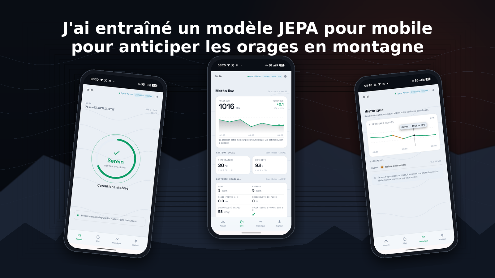
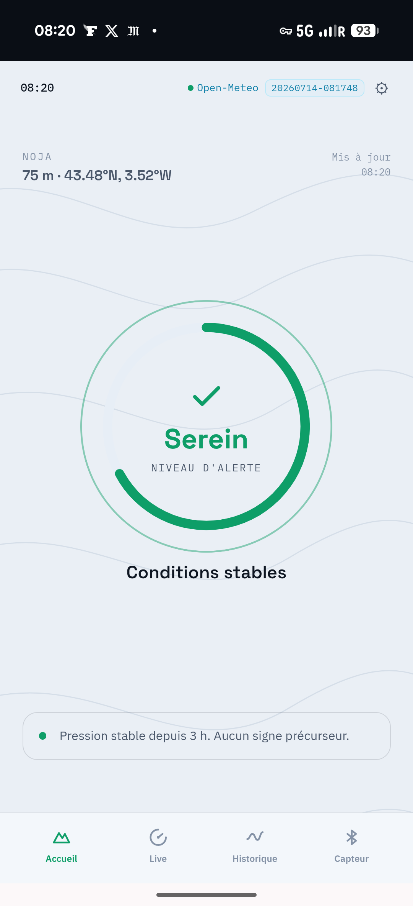
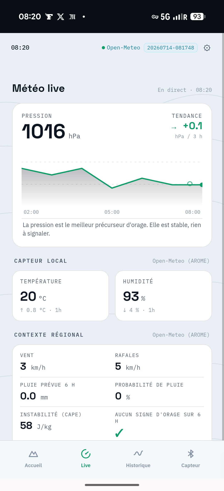
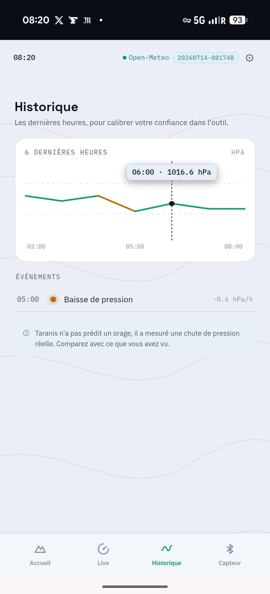

<div align="center">



# Taranis

**Un modèle JEPA sur mobile pour anticiper les orages en montagne.**

Souverain, ouvert, sans backend, sans dépendance au cloud.

[](https://www.gnu.org/licenses/agpl-3.0)
[](https://www.python.org/downloads/)
[](https://taranis.maudet.cloud)
[](https://meteo.data.gouv.fr/)
[](https://onnx.ai/)
[](https://taranis.maudet.cloud)

[Live demo](https://taranis.maudet.cloud) · [Article de fond](https://blog.maudet.cloud/blog/jepa-dans-un-navigateur-chronique-carnet-au-produit/) · [Contributing](CONTRIBUTING.md) · [License](LICENSE)

</div>

---

## Qu'est-ce que Taranis

Taranis est un système d'alerte orage pensé pour le randonneur : il prédit la probabilité d'un orage à horizon 24 heures **directement dans le navigateur du téléphone**, à partir des mesures d'un petit capteur Bluetooth Low Energy porté dans le sac à dos, ou de données Open-Meteo en repli.

- **Aucun backend** consulté à l'inférence
- **Aucune donnée utilisateur** ne quitte le téléphone
- **Un modèle < 500 KB** téléchargé une fois puis servi hors ligne
- **Un carnet pédagogique** de 18 chapitres qui documente la démarche brique par brique
- **Sous licence AGPL-3.0**, données [Etalab](https://www.etalab.gouv.fr/), pas de télémétrie, pas de cookie

## Aperçu de l'application

<div align="center">
  
  
  
</div>

De gauche à droite : **Accueil** (bague d'alerte VERT/ORANGE/ROUGE, probabilité d'orage, position réverse-géocodée), **Live** (pression instantanée + courbe 6 h + contexte régional Open-Meteo), **Historique** (courbe interactive avec crosshair au tap, liste d'événements de baisse de pression).

## Deux modèles, un même harnais

Taranis embarque **deux moteurs d'inférence** que l'utilisateur peut basculer à chaud dans les réglages.

| Moteur | Type | Taille | Inférence | AUC test | Détection orage | Fausse alarme |
|---|---|---|---|---|---|---|
| **HGB-3ch** | HistGradientBoosting sklearn (200 arbres) | **438 KB** JSON | ~1 ms | **0.7734** | **90.7 %** | 26.8 % |
| **TS-JEPA-3ch** | Transformer 3 couches × 64 dim ([TS-JEPA](https://arxiv.org/abs/2505.13438), Ennadir 2025) | **476 KB** ONNX | ~5 ms | 0.7350 | 85.8 % | 30.8 % |

**HGB gagne partout sauf en transfert cross-régime plaine vers montagne**, où TS-JEPA rattrape 2 points. Ce point unique motive la prochaine étape (canaux verticaux ERA5 + entraînement multi-canaux).

Les deux moteurs partagent le même **harnais** : source Open-Meteo ou capteur BLE, fenêtre glissante 24 h, buffer IndexedDB, géolocalisation opt-in avec auto-refresh 10 min, reverse geocoding OSM, i18n cinq langues, service worker cache-first, HTTPS souverain.

## Démarrage rapide

### Utilisateur final

Ouvre [taranis.maudet.cloud](https://taranis.maudet.cloud) sur ton téléphone. Menu Chrome → « Ajouter à l'écran d'accueil » pour l'installation PWA. L'application marche hors ligne dès la première visite installée.

### Développeur

```bash
# Installer les dépendances (Python 3.13+ via uv)
uv sync --extra dev --extra docs --extra era5

# Lancer la suite de tests
uv run pytest

# Ouvrir le carnet pédagogique 18 chapitres en local
uv run mkdocs serve
# → http://127.0.0.1:8000

# Réentraîner un modèle HGB à partir des données SYNOP
uv run python scripts/baseline_3ch_tw8.py
uv run python scripts/export_hgb_tw8_json.py

# Servir la PWA en local pour tests navigateur
cd taranis/infer/static && python3 -m http.server 8899
# → http://127.0.0.1:8899
```

### Déployeur

La PWA est un dossier statique. `docker compose` avec Caddy suffit :

```bash
# Cf. Makefile pour les cibles principales :
make deploy    # bump SW version + reload Caddy
make verify    # smoke-test des endpoints publics
make audit     # audit E2E complet (31 checks)
```

## Architecture

```
Utilisateur (téléphone, offline-capable)
    │
    │  HTTPS Let's Encrypt via Caddy 2
    │
    ▼
┌──────────────────────────────────────────────┐
│  PWA statique servie par Caddy (souverain)   │
│  taranis/infer/static/                       │
│                                              │
│  index.html  css/  js/  models/  icons/      │
│  service worker cache-first                  │
│  IndexedDB pour buffer 24 h capteur          │
└──────┬───────────────────────────┬───────────┘
       │                           │
       ▼                           ▼
┌──────────────┐            ┌─────────────────┐
│  HGB-3ch     │            │  TS-JEPA-3ch    │
│  438 KB JSON │            │  476 KB ONNX    │
│  eval JS 20  │            │  onnxruntime-   │
│  lignes      │            │  web (WASM)     │
└──────────────┘            └─────────────────┘

Sources de données (opt-in)
    ▲                              ▲
    │                              │
Open-Meteo hourly              RuuviTag Pro
(pressure_msl, T, HR)          (BLE, P, T, HR)
```

Le training et l'export sont documentés étape par étape dans les 18 chapitres du carnet MkDocs (`docs/`).

## Structure du dépôt

```
taranis/
├── taranis/                    # Code Python
│   ├── data/                   # Chargeurs Météo-France + ERA5
│   ├── models/                 # BaselinePhysics, Baseline3chHGB, TSJEPA
│   ├── train/                  # Boucle d'entraînement TS-JEPA
│   ├── eval/                   # Bootstrap AUC, LOO, cross-régime
│   ├── infer/                  # FastAPI backup + PWA statique
│   │   ├── static/             # ← LA PWA COMPLÈTE
│   │   │   ├── index.html
│   │   │   ├── css/, js/, icons/
│   │   │   ├── models/         # hgb_3ch_tw8.json + tsjepa_3ch.onnx
│   │   │   └── sw.js           # service worker
│   │   └── api.py              # backend FastAPI legacy
│   └── ...
├── scripts/                    # Prépa dataset, entraînement, export
├── configs/                    # Configs YAML pour TS-JEPA
├── docs/                       # Carnet MkDocs 18 chapitres
├── data/                       # (git-ignored) SYNOP + ERA5 téléchargés
├── runs/                       # (git-ignored) checkpoints + logs éval
├── CONTRIBUTING.md
├── LICENSE                     # AGPL-3.0-or-later
└── README.md
```

## Approche pédagogique

Le carnet complet, en dix-huit étapes, part du problème et arrive au produit :

1. Le problème d'alerte orage
2. Le dataset d'entraînement (SYNOP + labels combinés)
3. Baseline physique honnête
4. JEPA en une image
5. TS-JEPA brique par brique
6. Entraîner et surveiller le collapse
7. Le verdict honnête sur le synthétique
8. Passage à l'échelle SYNOP + ERA5 + GPU
9. Enrichir les canaux
10. Vrais labels d'orage (WMO)
11. L'app d'inférence
12. Le serveur autonome
13. Journal honnête de calibration
14. La physique du modèle
15. Évaluation rigoureuse (bootstrap AUC + LOO + cross-régime)
16. Recalibration ORANGE / ROUGE
17. Contrôle TS-JEPA vs baseline HGB
18. Sonde capteur 3 canaux

`uv run mkdocs serve` ouvre le carnet localement.

## Matériel

**Capteur en production** : [RuuviTag Pro 4-in-1](https://ruuvi.com/ruuvitag-pro/) (~56 EUR), matériel + firmware open source (Finlande), IP67, pile CR2477 pour 12 à 24 mois d'autonomie, plage thermique −40 à +85 °C. Mesure pression, température, humidité en broadcast BLE natif toutes les secondes. Aucun anémomètre : le vent est complété via Open-Meteo régional en opt-in.

**Support smartphone** : Android Chrome/Edge (Web Bluetooth natif) ou iPhone via [Bluefy](https://apps.apple.com/us/app/bluefy-web-ble-browser/id1492822055) (App Store, gratuit).

## Standards respectés

- Licence [AGPL-3.0-or-later](LICENSE)
- Données sous licence [Etalab](https://www.etalab.gouv.fr/licence-ouverte-open-licence/) (Météo-France SYNOP)
- Formats standards : **ONNX** pour les modèles, **NetCDF** pour ERA5, **CSV/Parquet** pour SYNOP
- Web standards : **PWA** installable, **Service Worker**, **Web Bluetooth**, **Cache API**, **IndexedDB**, i18n via `navigator.language`
- Code Python conforme **PEP 8**, tests **pytest**, linting **ruff**
- Documentation en **MkDocs Material**
- Commentaires code en anglais, doc utilisateur en français (voir `CONTRIBUTING.md`)
- Pas de tiret cadratin dans le contenu, code ou commit (convention rédactionnelle)

## Contribuer

Voir [`CONTRIBUTING.md`](CONTRIBUTING.md).

Issues et PR bienvenues. Le projet est petit et documenté ; un onboarding en une demi-journée est possible pour quiconque connait Python et un peu de JavaScript.

## Feuille de route

- [x] Baseline HGB entraînée, évaluée, exportée
- [x] TS-JEPA entraîné, comparé, exporté
- [x] PWA installable, HTTPS souverain, i18n 5 langues
- [x] Open-Meteo comme source par défaut, capteur BLE prévu
- [x] Article de fond publié
- [ ] Ingestion Web Bluetooth Ruuvi v5 réel (arrivée matériel 19 juillet 2026)
- [ ] Téléchargement ERA5 complet (~4 semaines, en tâche de fond)
- [ ] TS-JEPA enrichi (10+ canaux verticaux, 500 hPa + 850 hPa + CAPE + géopotentiel)
- [ ] Comparaison honnête HGB vs TS-JEPA sur canaux enrichis
- [ ] Application iOS native si les retours utilisateur le justifient

## Références scientifiques

- Ennadir S., Golkar S., Sarra L. *Joint Embeddings Go Temporal (TS-JEPA)*. arXiv:2509.25449, 2025.
- Assran M. et al. *Self-Supervised Learning from Images with a Joint-Embedding Predictive Architecture*. CVPR 2023.
- Bardes A. et al. *Revisiting Feature Prediction for Learning Visual Representations from Video*. TMLR 2024.
- LeCun Y. *A Path Towards Autonomous Machine Intelligence*. Position paper, 2022.

## Article de fond

L'expérience détaillée est racontée dans un article de blog :
[**« J'ai entraîné un modèle JEPA pour mobile pour anticiper les orages en montagne »**](https://blog.maudet.cloud/blog/jepa-dans-un-navigateur-chronique-carnet-au-produit/).

## Licence

Code : **AGPL-3.0-or-later**. Voir [LICENSE](LICENSE).

Données d'entraînement : [Météo-France SYNOP](https://meteo.data.gouv.fr/) sous licence Etalab (données ouvertes), [ERA5](https://cds.climate.copernicus.eu/) sous licence Copernicus.

Modèles pré-entraînés distribués dans `taranis/infer/static/models/` : sous la même licence AGPL-3.0-or-later que le code.

## Remerciements

Merci à Météo-France pour SYNOP en accès libre, à Copernicus pour ERA5, à [Open-Meteo](https://open-meteo.com/) pour l'API gratuite sans clé, à [OpenStreetMap Nominatim](https://nominatim.openstreetmap.org/) pour le reverse geocoding, à [Ruuvi Innovations](https://ruuvi.com/) pour le matériel BLE open source, à toute la communauté [ONNX](https://onnx.ai/) et [scikit-learn](https://scikit-learn.org/).

---

<div align="center">

**Taranis** · un projet [maudet.cloud](https://blog.maudet.cloud) · souverain par construction

</div>
