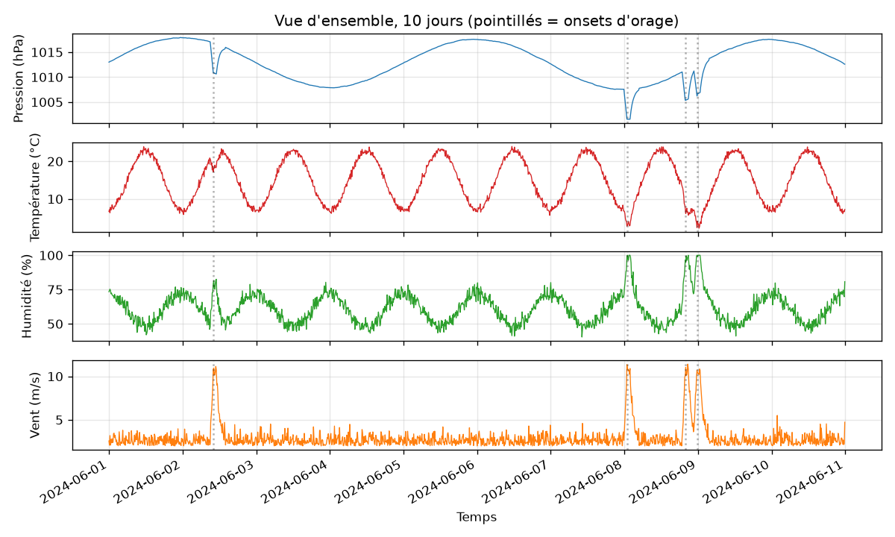
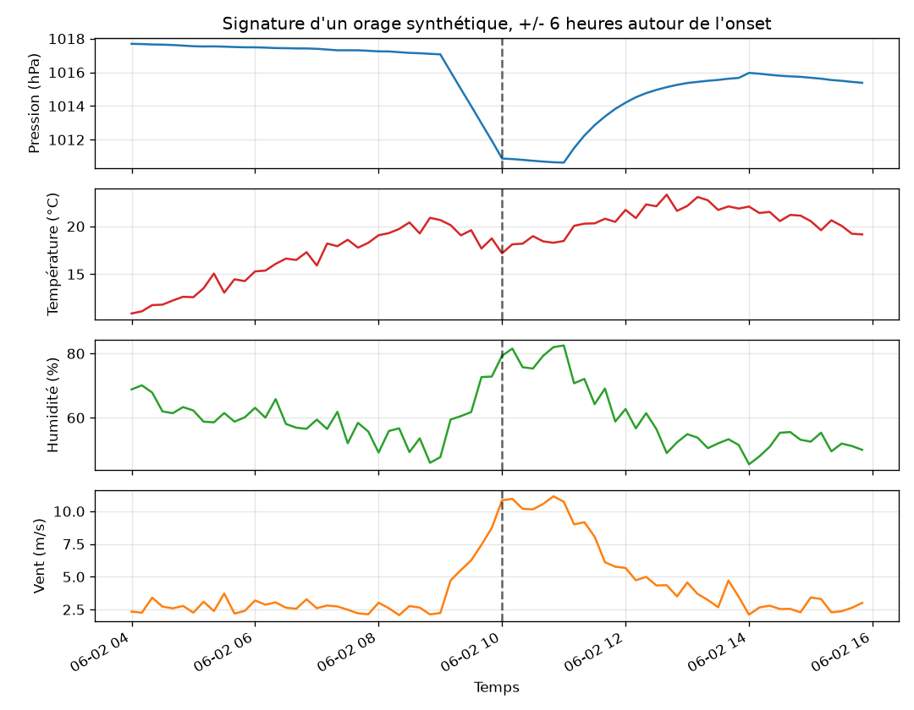

# Étape 1, le problème

Avant de parler d'architecture, de transformers ou d'auto-supervisé, on regarde les données. On va simuler un capteur météo local pendant dix jours et voir à quoi ressemble un orage dans les mesures. Ce regard nous dira si le projet a du sens et ce qu'un modèle est censé apprendre.

## Le capteur qu'on imagine

Un boîtier posé sur un sac à dos, en montagne. Il mesure toutes les dix minutes quatre grandeurs :

| Grandeur       | Unité | Ce que ça capte                             |
|---             |---    |---                                          |
| Pression       | hPa   | La respiration de l'atmosphère              |
| Température    | °C    | Le cycle jour-nuit et la masse d'air        |
| Humidité       | %     | La proximité de la condensation             |
| Vent           | m/s   | Les rafales et l'agitation locale           |

Ces quatre canaux, c'est notre entrée. Rien d'autre. Pas de radar, pas de satellite, pas de station voisine. Un point unique dans l'espace et dans le temps.

## Un signal synthétique, pour commencer

On n'a pas encore de vraies données Météo-France sous la main, et de toute façon on veut d'abord un environnement où l'on contrôle tout. On code un générateur synthétique dans `taranis/data/synthetic.py`.

Ce générateur produit :

- une pression qui respire lentement (cycles synoptiques de quelques jours),
- une température qui suit le cycle jour-nuit,
- une humidité anti-corrélée à la température,
- un vent de base faible,
- et, superposés à ce fond, des **orages** tirés aléatoirement selon une loi de Poisson, qui laissent chacun une signature identifiable.

Voici la vue d'ensemble sur dix jours simulés :



Les pointillés verticaux marquent les *onsets* d'orage. On voit à l'œil qu'il se passe quelque chose : la pression pique vers le bas, le vent fait une saute, l'humidité grimpe brutalement. La température, elle, encaisse le choc plus discrètement, noyée dans son cycle diurne. C'est déjà une leçon utile : selon les canaux, la signature est plus ou moins lisible. Un modèle devra apprendre à pondérer ce qui est informatif.

## Zoom sur un orage

Regardons maintenant six heures avant et six heures après un onset :



Le trait pointillé vertical est l'onset, le moment où l'orage bat son plein. Ce qui se passe autour :

- **Pression** : elle chute d'environ 6 hPa sur une heure avant l'onset. C'est la signature la plus nette et c'est ce que le baromètre montre déjà à un randonneur attentif.
- **Humidité** : elle monte franchement, +30 points, dans les trente minutes qui précèdent l'onset. L'atmosphère se sature.
- **Vent** : rafale marquée juste avant et pendant l'onset. C'est l'onset lui-même dans le vécu du randonneur.
- **Température** : léger fléchissement, mais quasiment invisible ici car le cycle diurne domine. C'est un canal faible pour cette tâche.

**Ce qui définit notre tâche.** Le modèle doit regarder une fenêtre de mesures récentes et dire : « oui, un orage arrive dans les prochaines minutes ou heures », ou « non, tout est calme ». Autrement dit, il doit apprendre à reconnaître la période d'approche, avant que le vent ne rende la décision évidente. C'est là que l'anticipation a de la valeur : plus on repère tôt, plus on gagne en temps de réaction.

## Ce que le générateur produit

Le code renvoie un `DataFrame` pandas avec un pas de temps régulier et sept colonnes :

```python
from taranis.data.synthetic import generate

df = generate(days=10.0, step_minutes=10, storms_per_day=0.5, seed=42)
df.head()
```

| timestamp | pressure | temp | humidity | wind | storm_active | storm_onset |
|---|---|---|---|---|---|---|

Les deux dernières colonnes sont les étiquettes que l'on utilisera plus tard, uniquement pour évaluer et pour entraîner la sonde aval. **Elles ne servent jamais au pré-entraînement JEPA**, on y reviendra à l'étape 5.

- `storm_onset` : `True` uniquement à l'instant précis où l'orage bat son plein.
- `storm_active` : `True` pendant toute la durée du plateau d'orage.

## Ce qu'il faut retenir

1. On travaille sur un signal multivarié régulier, quatre canaux physiques.
2. Un orage laisse une signature reconnaissable, mais inégale selon les canaux.
3. La tâche utile est **l'anticipation** de la période d'approche, pas la simple détection au moment où tout le monde voit déjà l'orage.
4. On a besoin d'un modèle qui apprenne à pondérer les canaux et à reconnaître un pattern temporel qui précède un événement rare.

À l'étape 2, on va se demander jusqu'où un modèle **très simple** peut aller sur cette tâche. C'est la baseline honnête qui restera dans le dépôt pour toujours.

## Reproduire

```bash
uv run pytest tests/test_synthetic.py
uv run python scripts/render_step1_figures.py
```

Les figures sont régénérées à l'identique tant que la seed reste fixe. Le générateur est testé pour ça, voir `tests/test_synthetic.py`.
