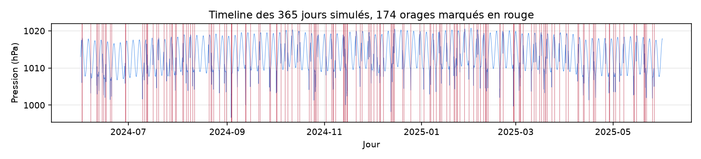
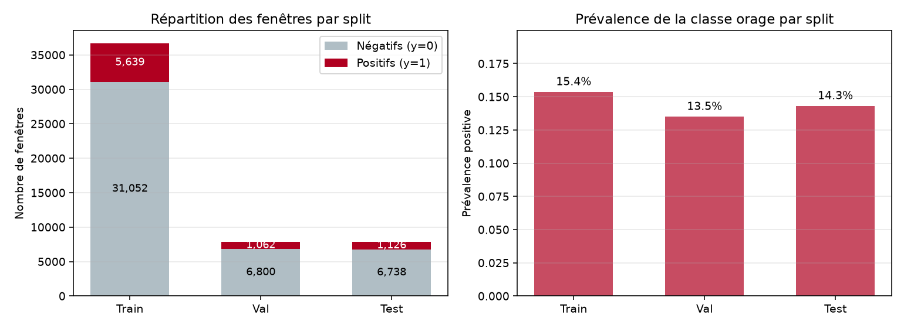
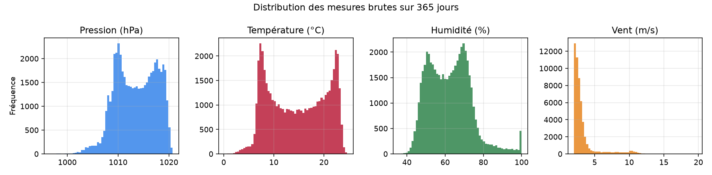

# Étape 1 bis, le dataset d'entraînement

L'étape 1 a montré à quoi ressemble un orage vu par un capteur. Cette étape complémentaire répond à trois questions que tout lecteur se pose avant de croire au reste : **d'où viennent les données**, **combien y en a-t-il**, et **comment sont-elles préparées pour être données à un modèle**. On documente ici la volumétrie et le pipeline, sans lesquels les métriques des étapes suivantes ne veulent rien dire.

## D'où viennent les données

**Statut actuel : entièrement synthétique.** Le dataset est produit par le générateur `taranis/data/synthetic.py` que l'on a introduit à l'étape 1. Aucune donnée réelle n'est utilisée dans cette phase pédagogique.

C'est un **choix assumé, pas un pis-aller**. Trois raisons.

1. **Reproductibilité totale.** Le générateur est déterministe à seed fixée. Deux personnes qui lancent `scripts/prepare_dataset.py` obtiennent exactement le même dataset, exactement les mêmes fenêtres, exactement les mêmes labels. Cela rend chaque expérience rejouable sans le moindre doute.
2. **Vérité terrain parfaite.** L'onset et la durée de chaque orage sont connus par construction. Avec des archives foudre (Blitzortung, réseaux nationaux), il faut négocier avec des lacunes, des faux positifs, des désalignements horaires. Ces négociations sont importantes mais **elles brouillent la pédagogie**. On veut d'abord voir si un modèle marche quand l'oracle est parfait.
3. **Zéro dépendance externe.** Pas d'API, pas de clé, pas de rate limit. Le pipeline tourne sur un ordinateur portable, sur CI, sans réseau. C'est un préalable pour que le code soit accessible à toute personne qui clone le dépôt.

**Prochain jalon prévu :** brancher les données horaires ouvertes de Météo-France sur un point unique, en utilisant leur portail de données publiques. Le format de fenêtres et l'API restent identiques, ce qui permettra de basculer d'un `chargeur` à l'autre sans changer le reste. Ce jalon arrivera **après** que TS-JEPA ait été entraîné et évalué sur synthétique, pour ne pas mélanger deux difficultés en une.

## À quoi ressemble une année simulée

Le script `scripts/prepare_dataset.py` produit une année complète de mesures. Les paramètres sont explicites et modifiables :

| Paramètre         | Valeur | Justification                                             |
|---                |---     |---                                                        |
| Durée simulée     | 365 jours | Une saison complète, dominée par une variabilité pluri-jours |
| Pas d'échantillonnage | 10 minutes | Compromis entre finesse de la signature et volume de données |
| Nombre de canaux  | 4      | Pression, température, humidité, vent, comme sur un capteur BME280 + anémomètre |
| Taux d'orages     | 0.4 par jour | Environ 12 orages par mois, réaliste en été montagne |
| Seed              | 0      | Reproductibilité                                          |

Ce qui donne un signal continu de **52 560 pas de temps** ligne à ligne. Sur cette année, la loi de Poisson tire **174 orages**. Voici leur répartition dans le temps, sur fond de pression :



Le fichier brut ainsi produit fait environ 5 Mo, format CSV, sauvegardé dans `data/synthetic_raw.csv`. C'est notre matière première. Il n'est pas versionné dans le dépôt, il est régénéré à la demande.

## Ce qu'on donne au modèle, ce ne sont pas les mesures brutes

Un modèle ne prend pas 52 560 lignes en entrée d'un coup. Il travaille sur des **fenêtres**. C'est le rôle de `taranis/data/windows.py`.

Le principe :

- On glisse une fenêtre de longueur `Tw = 96` pas (16 heures) le long du signal, avec un pas de `stride = 1` (un décalage de 10 minutes entre deux fenêtres consécutives).
- Pour chaque fenêtre finissant à l'instant `t`, on regarde l'**horizon** `[t+1, t+H]` avec `H = 48` pas (8 heures). Si un onset d'orage tombe dans cet horizon, l'étiquette vaut 1, sinon 0.

Ce fenêtrage produit **52 417 exemples** au total, chacun de forme `(Tw, V) = (96, 4)`. On dépasse largement les besoins de M0 (régression logistique légère) et on a la matière pour pré-entraîner TS-JEPA.

Choix conceptuels importants :

- **Tw = 16 h** couvre confortablement la période d'approche d'un orage (jusqu'à 4 heures dans notre profil synthétique) plus le contexte de la journée précédente (cycle diurne).
- **H = 8 h** est notre **horizon d'anticipation**. Le modèle doit détecter les signes d'un orage jusqu'à 8 heures à l'avance. C'est ambitieux et cohérent avec le PRD.
- **stride = 1** maximise les exemples. Il y a du chevauchement massif entre fenêtres, ce qui **n'est pas** un problème dans notre configuration parce que le split reste strictement chronologique (voir plus bas).

## Le split chronologique

**On ne mélange jamais des exemples d'une série temporelle au hasard.** Une fenêtre du jour 100 utilisée pour entraîner, testée sur une fenêtre du jour 101, produit une fuite d'information massive : les deux fenêtres se chevauchent, elles regardent presque le même signal. L'AUC obtenue est un mirage.

La règle est simple. On coupe **dans l'ordre du temps** :

- **70 %** des fenêtres les plus anciennes → **train**
- **15 %** au milieu → **val**
- **15 %** les plus récentes → **test**

En chiffres :



| Split | Fenêtres | Positifs | Négatifs | Prévalence |
|---    |---      |---       |---       |---         |
| Train | 36 691  | 5 639   | 31 052  | 15.4 %     |
| Val   | 7 862   | 1 062   | 6 800   | 13.5 %     |
| Test  | 7 864   | 1 126   | 6 738   | 14.3 %     |

**Trois choses à noter.**

1. La prévalence positive est **stable** entre les splits, entre 13.5 % et 15.4 %. C'est un bon signe : le régime des orages ne change pas trop au fil de l'année simulée. Sur des données réelles avec forte saisonnalité, on veillera à ce que le split ne concentre pas les orages dans une seule fenêtre temporelle.
2. Le **jeu de test** est chronologiquement le plus récent. Il représente exactement la situation d'un usage réel : le modèle a été entraîné sur le passé, on l'évalue sur le futur.
3. **Aucun échantillon n'est perdu**. Les 143 fenêtres qui ne rentrent pas parfaitement dans les 70/15/15 sont incluses dans le test, pas jetées.

Le fichier `data/synthetic_windows.npz` (≈ 1.6 Mo, compressé) contient tout : `X_train, y_train, ts_train, X_val, y_val, ts_val, X_test, y_test, ts_test`, plus les statistiques de normalisation.

## Normalisation, calculée sur le train uniquement

On calcule la moyenne et l'écart-type de chaque canal **sur le train**, puis on normalise train, val et test avec ces mêmes statistiques. On n'utilise **jamais** les stats du val ou du test pour normaliser, sous peine de fuite d'information. C'est un détail classique mais souvent bâclé.

Valeurs mesurées sur notre train :

| Canal    | Moyenne | Écart-type |
|---       |---      |---         |
| Pressure (hPa) | 1022.70 | 9.97   |
| Temp (°C)      | 14.72   | 5.72   |
| Humidity (%)   | 62.17   | 11.16  |
| Wind (m/s)     | 3.28    | 1.99   |

Après normalisation, chaque canal est centré-réduit sur le train. Les distributions brutes, elles, montrent bien la structure du signal :



- **Pression bimodale**, reflet de l'oscillation synoptique lente (4 jours de période).
- **Température très bimodale**, dominée par le cycle jour-nuit.
- **Humidité anti-corrélée**, bimodale symétrique. Le petit pic à 100 % vient des orages, la valeur est bornée.
- **Vent très asymétrique**, avec une longue queue à droite. La grande majorité du temps est calme, les rares valeurs élevées correspondent aux rafales d'orage. C'est un canal **rare mais informatif**.

Ces distributions ne servent pas directement à l'entraînement, mais elles rappellent une chose importante : **notre signal a une structure forte, pas juste du bruit**. Un modèle qui ignorerait la structure serait mauvais par nature.

## Reproduire

```bash
# Génère le signal brut, les fenêtres, les splits, la normalisation
uv run python scripts/prepare_dataset.py

# Régénère les figures descriptives
uv run python scripts/render_dataset_figures.py
```

Après ces deux commandes, on a :

- `data/synthetic_raw.csv` — la série brute (~5 Mo, non versionnée)
- `data/synthetic_windows.npz` — les fenêtres prêtes à l'emploi (~1.6 Mo, non versionnée)
- `docs/assets/step1b_*.png` — les figures descriptives

## Ce qu'il faut retenir avant l'étape 2

1. Le dataset est **synthétique**, reproductible, avec vérité terrain parfaite. C'est un choix pédagogique.
2. On a **365 jours** de mesures multivariées à un pas de 10 minutes, soit environ **52 000 exemples fenêtrés**, avec une **prévalence de 14 %** de fenêtres pré-orageuses.
3. Le **split est chronologique** (70 / 15 / 15) et la **normalisation calée sur le train uniquement**. Ce sont les deux règles d'hygiène qui protègent contre la fuite d'information.
4. Le pipeline est **totalement reproductible** en deux commandes, sans réseau, sans clé, sans donnée externe.
5. La prochaine étape (**M0**) et toutes les suivantes travaillent **sur ce même fichier `synthetic_windows.npz`**, garantissant que la comparaison M0 contre M1 se fait à données strictement identiques.
