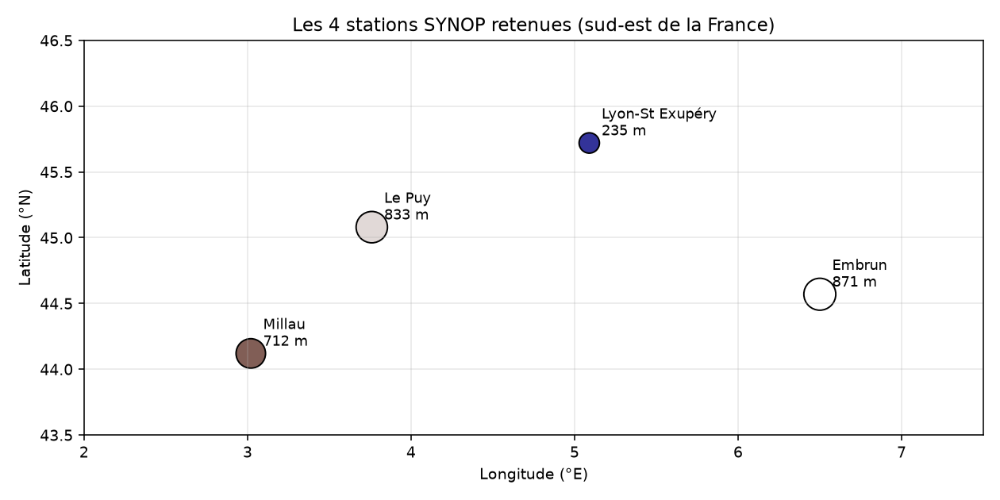
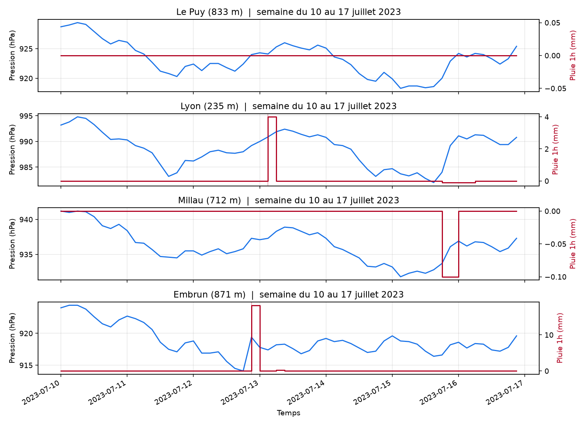
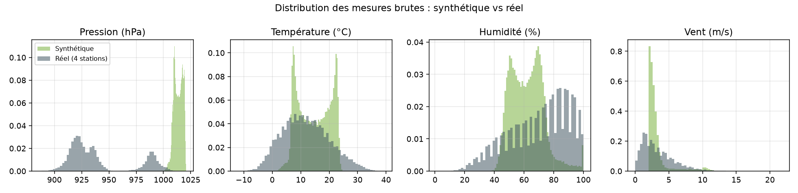
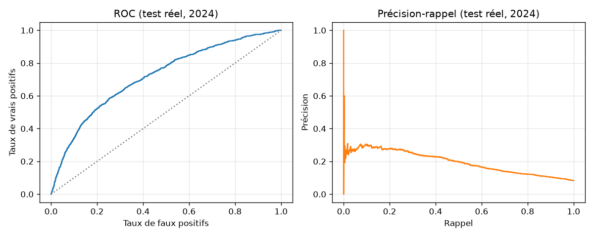

# Étape 1 ter, brancher les données réelles

L'étape 1 bis présentait le dataset synthétique. On rebranche maintenant le pipeline sur de **vraies données Météo-France**, en parallèle. L'objectif n'est pas d'abandonner le synthétique, il est de **comparer** ce qu'on apprend d'un signal parfaitement contrôlé et ce qu'on apprend d'un signal réel, avec toutes ses aspérités. C'est le vrai test du transfert **sim-to-real**, une question de recherche à part entière.

## Où trouver du SYNOP ouvert et souverain

Météo-France diffuse ses observations SYNOP dans le cadre du service public de la donnée. On y accède aujourd'hui via deux points principaux :

- **meteo.data.gouv.fr** : portail officiel de mise à disposition, en migration.
- **public.opendatasoft.com** : héberge une copie enrichie, avec API REST et exports CSV filtrables. Pas de clé, licence Etalab.

Pour Taranis on utilise l'API Opendatasoft. Elle est stable, elle permet des filtres serveur (par station, par date), et elle sort du CSV point-virgule directement exploitable.

**Source précise :** dataset `donnees-synop-essentielles-omm`, endpoint d'export CSV. Une seule requête suffit pour rapatrier plusieurs années sur plusieurs stations.

## Le choix des stations

On prend quatre stations dans le sud et le sud-est, choisies pour couvrir des régimes météorologiques différents :



| ID       | Nom             | Altitude | Contexte                              |
|---       |---              |---       |---                                    |
| 07481    | Lyon-St Exupéry | 235 m    | Plaine du Rhône, référence de plaine |
| 07558    | Millau          | 712 m    | Grand Causses, plateau calcaire      |
| 07471    | Le Puy-Loudes   | 833 m    | Massif Central, plateau volcanique   |
| 07591    | Embrun          | 871 m    | Alpes du sud, vallée abritée         |

Quatre altitudes différentes, quatre climats locaux différents. Cette diversité est utile parce qu'elle nous force à apprendre des représentations qui **ne se réduisent pas à une seule station**, ce qui est plus proche de la situation réelle d'un capteur portable qui bouge.

## Ce qui change par rapport au synthétique

Trois différences structurelles à intégrer avant tout entraînement.

### 1. La fréquence d'échantillonnage

SYNOP diffuse ses observations **toutes les 3 heures** (00, 03, 06, 09, 12, 15, 18, 21 UTC). C'est 18 fois plus grossier que les 10 minutes du synthétique. Concrètement, cela veut dire :

- une année complète pèse **2 920 observations** par station (contre 52 560 en synthétique 10 min),
- on ne verra jamais une signature de pré-orage qui se déploie sur moins de 3 heures,
- il faut **redimensionner** les fenêtres de contexte et l'horizon pour rester réalistes.

Nos choix pour le réel :

| Paramètre | Synthétique | Réel |
|---        |---         |---   |
| Pas       | 10 minutes | **3 heures** |
| `Tw`      | 96 pas (16 h) | **32 pas (96 h = 4 jours)** |
| `H`       | 48 pas (8 h) | **8 pas (24 h)** |

Sur le réel, on regarde donc **quatre jours d'histoire** pour prédire s'il pleuvra fort **dans les 24 heures**. C'est un horizon d'anticipation plus long, adapté au pas de temps disponible.

### 2. Les manquants et le rééchantillonnage

Les données réelles ont des trous. Pannes de station, transmissions ratées, périodes de maintenance. Ordre de grandeur observé :

| Canal    | Taux de NaN dans le brut |
|---       |---                       |
| Pression | 0.00 à 0.01 %             |
| Température | 0.00 à 0.02 %          |
| Humidité | 0.00 à 0.02 %             |
| Vent     | 0.01 à 0.04 %             |
| Pluie 1h | 0.03 à 0.84 %             |

Rien de dramatique, mais on doit s'en occuper. La stratégie est simple :

- rééchantillonner sur la grille régulière 3h alignée sur les heures rondes,
- interpoler linéairement les petits trous (jusqu'à 6 h),
- pour les canaux de pluie, on **n'interpole pas** (on ne veut pas inventer de la pluie qui n'a pas eu lieu), on laisse en NaN,
- en aval, on jette les fenêtres qui contiennent encore un NaN sur un canal utile.

Le tout est implémenté dans `taranis/data/meteofrance.py`, fonction `resample_regular`.

### 3. Les étiquettes ne sont plus la vérité terrain

Sur synthétique, on connaissait chaque onset d'orage par construction. Sur le réel, il n'y a pas d'oracle. Deux options.

- **Proxy foudre**, via Blitzortung. Précis, mais accès et alignement horaire non triviaux, une couche de complexité qu'on préfère éviter à ce stade.
- **Proxy pluie forte**, via `rr1 > 2 mm/h`. Grossier, mais présent dans le SYNOP, disponible pour toutes les stations. C'est ce qu'on choisit.

On étiquette donc `storm_onset = True` au premier pas de temps où la pluie horaire dépasse 2 mm. On garde en tête que cette étiquette **regroupe orages, averses stratiformes et bruines soutenues**, ce qui est pédagogiquement acceptable et industriellement à raffiner plus tard.

## À quoi ressemblent les données réelles

Une semaine de juillet 2023 sur les 4 stations, avec pression (bleu) et pluie horaire (rouge) :



Les traits verticaux marquent les onsets « pluie forte ». On voit à Lyon un épisode marqué, à Millau et Embrun des épisodes fins, au Puy une semaine tranquille. La forme des séries est très différente du synthétique : plus de dynamique, cycles diurnes moins mécaniques, événements plus soudains.

Comparaison des distributions brutes des canaux, synthétique vs union des 4 stations réelles :



- **Pression** : le synthétique se concentre autour de 1010-1020 hPa (station basse altitude, atmosphère standard). Le réel a une distribution beaucoup plus étalée, avec un mode principal vers 920 hPa (les stations d'altitude 700-870 m) et une queue plus basse. **On ne compare pas des pressions absolues, ça n'aurait pas de sens.** On compare des tendances.
- **Température** : le synthétique est concentré entre 8 et 22 °C (juin uniquement). Le réel s'étend de -5 à +30 °C, avec toutes les saisons. La saisonnalité est un signal fort qui n'existait pas dans le synthétique.
- **Humidité** : bimodale en synthétique (cycle diurne pur), plus étalée en réel avec un pic à 100 % (jour humide).
- **Vent** : le réel a plus de valeurs élevées (queue plus lourde), reflet des vents synoptiques réels (mistral, tramontane).

**Ces différences ne sont pas des défauts, ce sont les données réelles.** L'enjeu du transfert sim-to-real est de savoir si les représentations apprises sur du synthétique restent utiles quand elles sont exposées à cette diversité, et vice versa.

## Volumétrie finale

Le script `scripts/prepare_real_dataset.py` produit `data/real_windows.npz` :

| Split | Période        | Fenêtres | Prévalence positive |
|---    |---             |---       |---                   |
| Train | 2020 à 2022    | 34 704   | 5.4 %                |
| Val   | 2023           | 11 457   | 6.8 %                |
| Test  | 2024           | 11 556   | 8.3 %                |

Deux observations importantes.

1. Le volume est **du même ordre** que le synthétique (~52k fenêtres). C'est appréciable pour comparer.
2. La prévalence positive **augmente** entre train et test (5.4 % → 8.3 %). L'année 2024 a été objectivement plus pluvieuse que la moyenne 2020-2022. C'est une réalité à laquelle un modèle réel est confronté : **le climat de l'entraînement n'est pas le climat du test**. On appelle ça un décalage de distribution (**distribution shift**), et un modèle robuste doit y résister.

## Premier verdict, baseline sur réel

On rejoue la baseline physique **exactement identique** que sur le synthétique, mais avec les lags physiques adaptés au pas de 3 heures :

- lag court = 3 heures (au lieu d'une heure),
- lag long = 12 heures (au lieu de 3 heures).

Résultats sur le test 2024 :



| Métrique                    | Synthétique | Réel  |
|---                          |---          |---    |
| AUC                         | **0.759**   | **0.719** |
| Précision moyenne (AP)      | 0.501       | 0.196 |
| Précision au seuil F1-max   | 0.747       | 0.227 |
| Rappel au seuil F1-max      | 0.479       | 0.409 |
| F1                          | 0.583       | 0.292 |
| Prévalence positive         | 14.3 %      | 8.3 % |

**Ce qu'on lit** :

- L'**AUC** est comparable, 0.72 vs 0.76. La baseline classe correctement les fenêtres réelles, c'est un bon signe.
- L'**Average Precision** chute fortement, à cause de la prévalence positive plus basse. C'est mécanique : moins de positifs, précision au seuil moins facile à obtenir. Sur données réelles, l'AP baseline (0.20) reste **deux fois et demi** supérieure à la prévalence (0.08), signal utile confirmé.
- La **précision** au seuil F1-max descend à 0.23, ce qui signifie qu'à ce seuil, **moins d'une alerte sur quatre est vraie**. Un randonneur sait déjà qu'il aura beaucoup de fausses alertes s'il croit tous les avertissements de son baromètre.

Coefficients dominants sur le réel :

```
temp_last               +0.794    saisonnalité, l'été prédit la pluie
humidity_last           +0.415    évident
humidity_mean_short     +0.367    corrélé au précédent
pressure_trend_long     -0.365    chute barométrique sur 12h, le signal utile
pressure_last           -0.354    pression basse absolue
pressure_trend_short    -0.209    tendance 3h, moindre poids
```

Trois choses à noter par rapport au synthétique.

1. **La température devient dominante.** En réel, la saisonnalité (mois de l'année) porte beaucoup de la variance. Les orages arrivent surtout en été chaud humide. Le synthétique n'avait pas cette saisonnalité, il n'utilisait pas la température.
2. **La tendance de pression longue (12h) prime sur la courte (3h).** À un pas de 3h, on ne voit pas la chute brutale ; ce qui reste visible, c'est la baisse progressive.
3. **La signature n'est plus une chute franche sur une heure.** Elle est un cocktail moins spectaculaire, ce qui explique aussi que les performances soient plus modestes.

## Ce qu'il faut retenir avant la suite

1. Les données réelles sont **accessibles, sans clé**, via l'API Opendatasoft du portail SYNOP. Une requête, un CSV.
2. On travaille sur **4 stations** du sud-est, altitudes 235 à 871 m, sur **5 ans**, soit un volume comparable au synthétique.
3. Trois différences structurelles à digérer : pas 3h au lieu de 10 min, présence de manquants, étiquettes proxy `rr1 > 2 mm` au lieu de vérité terrain d'orage.
4. La baseline physique **fonctionne sur les deux**, avec des performances comparables en AUC (0.72 vs 0.76). Les moteurs physiques du signal ne sont pas les mêmes : sur réel, la saisonnalité et la tendance longue de pression comptent le plus.
5. Le **décalage de prévalence** entre 2020-2022 et 2024 est un rappel utile, un modèle réel doit affronter le changement climatique et la variabilité inter-annuelle.

À l'étape 6, on entraînera TS-JEPA sur les deux datasets. À l'étape 7, on comparera M0 et M1 sur les deux, et on se posera sérieusement la question, **est-ce qu'un encodeur appris sur du synthétique aide sur du réel** ? C'est le vrai enjeu du sim-to-real.
