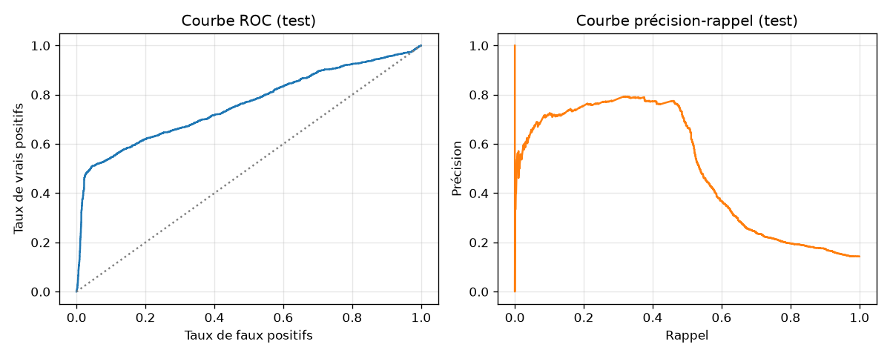

# Étape 2, une baseline honnête

Avant de sortir la grosse artillerie, on répond à une question simple : jusqu'où va-t-on avec un modèle **très basique** qui applique le bon sens d'un baromètre à main ? Cette baseline sert deux buts.

1. **Elle vérifie que la tâche est faisable.** Si un modèle simple ne fait pas mieux que le hasard, on n'a pas un problème d'architecture, on a un problème de données ou de labels.
2. **Elle sert de référence permanente.** Tout modèle plus sophistiqué devra battre cette baseline pour justifier son existence. Elle restera dans le dépôt et dans chaque rapport.

## Le pipeline

Trois étapes standard, aucune surprise :

1. Générer 365 jours de mesures synthétiques à un pas de 10 minutes, avec des orages aléatoires. Le générateur est [celui de l'étape 1](01-le-probleme.md).
2. Découper cette série en **fenêtres** de 96 pas (16 heures). Pour chaque fenêtre, l'étiquette vaut 1 si un orage démarre dans les 48 pas suivants (8 heures).
3. Split chronologique 70 / 15 / 15 en train, val, test. **Jamais aléatoire sur une série temporelle.**

Le script `scripts/prepare_dataset.py` fait tout ça et sauvegarde des fichiers prêts à consommer.

```bash
uv run python scripts/prepare_dataset.py
```

Sortie type :

```
Génération : 365 jours à 10 min, ~0.4 orages/jour
  → 52560 pas, 174 orages, 1.96 % du temps actif
Fenêtrage : Tw=96, H=48, stride=1
  → 52417 fenêtres, forme X=(52417, 96, 4)
  → split : train=36691, val=7862, test=7864
  → prévalence positive (y=1) : train=0.154, val=0.135, test=0.143
```

Environ 14 % de fenêtres positives. C'est déséquilibré mais pas extrême. On a de quoi apprendre.

## Ce que fait la baseline M0

Elle extrait dix features physiques de chaque fenêtre :

| Feature              | Intuition                                       |
|---                   |---                                              |
| `pressure_last`      | Niveau actuel de la pression                    |
| `pressure_trend_1h`  | Combien la pression a bougé sur la dernière heure |
| `pressure_trend_3h`  | Sur les trois dernières heures                  |
| `humidity_last`      | Niveau actuel de l'humidité                     |
| `humidity_mean_1h`   | Humidité moyenne sur la dernière heure          |
| `humidity_delta_1h`  | Variation sur la dernière heure                 |
| `wind_last`          | Vent actuel                                     |
| `wind_max_1h`        | Pic de vent récent                              |
| `temp_last`          | Température actuelle                            |
| `temp_amplitude`     | Amplitude thermique dans toute la fenêtre       |

Puis une régression logistique standardisée. Rien de plus. Le tout tient en une centaine de lignes de code, `taranis/models/baseline_physics.py`.

## Résultat

En rejouant `scripts/train_baseline.py` :

| Métrique     | Valeur  | Lecture                              |
|---           |---      |---                                   |
| **AUC**      | **0.759** | Bien au-dessus du hasard (0.5)      |
| Précision moyenne (AP) | 0.501 | Trois fois la prévalence, la baseline saisit vraiment quelque chose |
| Précision (au seuil optimal F1) | 0.747 | 3 alertes sur 4 sont vraies         |
| Rappel       | 0.479  | On rate 1 orage sur 2, coût sécurité |
| F1           | 0.583  | Compromis médian                     |



La courbe précision-rappel raconte la chose importante : la baseline sait rester **précise** jusqu'à environ 50 % de rappel, puis la précision s'effondre. Autrement dit, elle est bonne quand elle est sûre d'elle, et elle passe à côté d'orages moins « propres ».

## Ce que les coefficients disent

En interrogeant le modèle :

```
pressure_trend_1h       -1.158   dominante, chute barométrique = orage
temp_last               +0.383
humidity_last           +0.311
wind_max_1h             +0.272
pressure_trend_3h       +0.389   (colinéaire à 1h, signe qui compense)
...
```

Le poids dominant est bien celui qu'on attend : **la chute de pression sur une heure**. Signe négatif, ce qui signifie que plus la pression a chuté, plus la probabilité d'orage monte. La physique tient debout.

Les tendances 1h et 3h sont fortement corrélées : la régression logistique attribue tout le crédit à la 1h et redresse un peu la 3h pour compenser. C'est classique de la **multicolinéarité** et on le documente sans le corriger, ce n'est pas le problème du jour.

## Ce qu'il faut retenir avant de passer à JEPA

1. La tâche est faisable, un modèle basique atteint **AUC = 0.76** en piochant les bonnes features physiques.
2. La baseline **rate un orage sur deux** au seuil optimal. Pour un usage sécurité en montagne, ce n'est **pas assez**.
3. Les features ont été **choisies à la main**. Elles marchent, mais elles imposent une hypothèse, l'orage se signale surtout par la pression. Sur des orages non standards, humides sans chute de pression franche, ou dominés par le vent, cette main peut se tromper.
4. La question devient donc : **peut-on faire mieux, sans se contenter des features qu'on a devinées ?** C'est là que l'apprentissage de représentations, et JEPA en particulier, prend son sens.

## Reproduire

```bash
uv run python scripts/prepare_dataset.py    # génère data/synthetic_*
uv run python scripts/train_baseline.py     # entraîne, évalue, écrit le rapport
```

Rapport JSON : `runs/baseline/report.json`. Figures : `docs/assets/step2_curves.png`.
