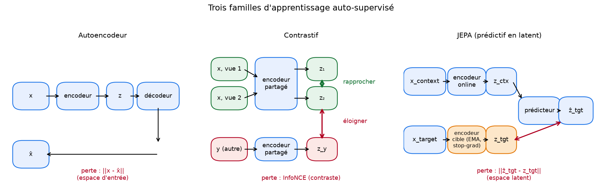

# Étape 3, pourquoi apprendre des représentations

À la fin de l'étape 2, on a une baseline **M0** qui atteint AUC = 0.76 sur notre tâche d'anticipation. Ce n'est pas mauvais, mais pas suffisant pour un usage sécurité. Deux limites structurelles apparaissent, et c'est en creusant ces limites qu'on va motiver JEPA.

## Ce que M0 fait bien, ce que M0 rate

M0 est un **modèle à features fabriquées à la main**. On lui a soufflé, en tant qu'humains, ce qu'il fallait regarder : tendance de pression, humidité, vent max. Cette main humaine est à la fois sa force et sa faiblesse.

- Sa **force** : le signal dominant, la chute barométrique, est capturé de façon interprétable. Le coefficient de `pressure_trend_1h` (négatif, grand) confirme la physique. On sait pourquoi le modèle décide ce qu'il décide.
- Sa **faiblesse** : les features supposent qu'un orage se signale toujours par le même schéma. Un orage humide sans chute franche de pression, un orage à composante venteuse dominante, une signature progressive au lieu de brutale, tout cela sort du cadre. **Le vrai signal est plus riche que nos features.**

Pour aller plus loin, il faudrait laisser le modèle **découvrir lui-même** ce qui compte dans le signal. Mais il y a un obstacle immédiat.

## Le problème des étiquettes

Sur notre synthétique, on a la vérité terrain de chaque orage. Dans le monde réel, ce n'est pas le cas.

- Un capteur portable individuel voit **très peu d'orages** dans sa vie utile. Cinq à vingt par saison, peut-être.
- Les archives foudre (Blitzortung) donnent des étiquettes mais avec du bruit, des lacunes, des faux positifs.
- Le fine-tuning d'un modèle profond sur quelques dizaines d'événements bruités **ne peut pas** apprendre à représenter finement la météo. On surapprendrait avant d'avoir généralisé.

En revanche, on a **beaucoup** de données sans étiquette. Chaque station, chaque année, produit des dizaines de milliers de mesures. On aimerait pouvoir apprendre quelque chose de utile à partir de ce déluge non annoté, puis affiner sur les rares événements labellisés.

**C'est exactement le pari de l'auto-supervisé.** On utilise la structure interne du signal, pas ses étiquettes, pour apprendre une représentation. Ensuite, on branche une petite tête supervisée sur cette représentation, avec très peu de labels.

## Auto-supervisé, trois familles

Il y a trois grandes façons de faire de l'auto-supervisé. Chacune a sa logique, ses forces, ses pièges. JEPA est l'une d'entre elles, mais pour comprendre son intérêt il faut voir les deux autres.

### Famille 1, l'autoencodeur, ou « redis-moi ce que tu as vu »

L'idée est simple. On compresse l'entrée `x` en une représentation `z` (le goulot d'étranglement), puis on essaie de reconstruire `x` à partir de `z` seul. Si la reconstruction est bonne, c'est que `z` contient l'essentiel de l'information.

- **Analogie** : lire un texte, le résumer sur un post-it, puis essayer de retrouver le texte original à partir du post-it. Le résumé forcé va contenir les grandes lignes.
- **Perte** : dans l'espace des données, `||x - x̂||²` ou variante.
- **Forces** : simple, stable, marche sur tout type de données.
- **Piège** : **l'objectif force le modèle à peindre chaque détail**, y compris le bruit et les artefacts sans intérêt. Sur une image, il perd de l'énergie à reproduire l'exact grain du capteur. Sur un signal capteur, il essaie de rejouer le bruit électronique. Cette pression pousse à des représentations qui privilégient les statistiques bas niveau au détriment de la structure haut niveau.
- Sur nos données, un autoencodeur apprendrait sans doute à reproduire les cycles diurnes et le bruit, mais pas nécessairement à distinguer un pré-orage d'un calme plat.

### Famille 2, le contrastif, ou « même ou différent »

L'idée : on prend deux « vues » du même exemple `x` (deux augmentations, deux crops, deux pas de temps proches), et on force l'encodeur à leur donner des représentations proches. En même temps, on prend un autre exemple `y` et on force la représentation de `y` à être éloignée.

- **Analogie** : dresser un enfant en lui montrant des paires de photos. « Ce sont deux photos du même chien à des instants différents, retiens que c'est proche. Cette autre photo est un chat, retiens que c'est loin. »
- **Perte** : InfoNCE ou triplet loss. Toutes reposent sur le mécanisme « attirer les positifs, repousser les négatifs ».
- **Forces** : sample-efficient, produit des représentations bien séparées.
- **Pièges** :
    - **Dépend fortement de la qualité des augmentations**. Sur du texte ou des séries temporelles, définir de « bonnes » augmentations est un art à part entière. Un crop temporel peut casser une signature de pré-orage.
    - **Nécessite beaucoup de négatifs par batch**, ce qui explique la mode des batchs géants (SimCLR, MoCo).
    - **Effet non-intuitif** : le modèle apprend à **discriminer** avant d'apprendre à **structurer**. Cette pression pousse à des représentations « surinformatives » qui capturent aussi ce qui ne devrait pas compter.

### Famille 3, le prédictif en espace latent, ou JEPA

L'idée coeur : on découpe l'entrée en deux morceaux, un **contexte** et une **cible**. On encode les deux. Puis on demande à un **prédicteur** de deviner la représentation de la cible **à partir de la représentation du contexte**, sans jamais chercher à reconstruire les valeurs brutes.

- **Analogie** : lire les premières pages d'un roman, puis décrire à quoi ressemble le chapitre 4 sans essayer de le récrire mot à mot. Ce qu'on capture, c'est l'**idée** du chapitre, pas ses phrases précises.
- **Perte** : dans l'espace latent, `||ẑ_target - z_target||`.
- **Forces** :
    - Le modèle **ignore naturellement le bruit** parce que la cible passe par un encodeur : ce qui est bruit dans les données brutes est neutralisé avant le calcul de la perte.
    - **Sample-efficient** : sur les benchmarks image (I-JEPA) et vidéo (V-JEPA), la famille JEPA rivalise avec les approches contrastives avec moins de calcul.
    - Aucune augmentation particulière à concevoir. Le masquage suffit.
- **Piège classique** : **le collapse de représentation**. Rien n'empêche l'encodeur d'apprendre la solution triviale « toutes les représentations sont identiques », auquel cas la prédiction est parfaite mais l'information disparaît. On en reparle en détail à l'étape 4 et surtout à l'étape 6.

## Pourquoi JEPA pour notre problème

Deux raisons concrètes.

1. **On a peu d'étiquettes réelles, beaucoup de mesures**. C'est exactement la situation où l'auto-supervisé bat le supervisé pur.
2. **Notre signal contient du bruit** (mesures capteur) et des **rythmes réguliers** (cycles diurnes) qui ne sont pas informatifs pour la tâche. Un autoencodeur peinerait à ignorer ces rythmes. Un modèle contrastif buterait sur la définition des vues. Un modèle JEPA, en prédisant **dans l'espace latent**, contourne les deux difficultés.

C'est une hypothèse, pas un théorème. Il faudra la vérifier avec la baseline à côté, comme convenu.

## Ce qu'il faut retenir avant l'étape 4

1. Les features à la main ont un plafond. Pour aller au-delà, on veut apprendre les features.
2. Peu d'étiquettes réelles, beaucoup de mesures : c'est la situation type de l'auto-supervisé.
3. Trois familles, trois compromis :
    - Autoencodeur : simple mais pollué par le bruit et les détails inutiles.
    - Contrastif : puissant mais gourmand en négatifs et fragile aux augmentations.
    - **JEPA** : prédictif en espace latent, propre par construction, mais avec un piège classique, le collapse.

À l'étape 4, on va décomposer précisément **comment** JEPA prédit dans l'espace latent, pourquoi ça marche, et pourquoi ça peut ne pas marcher.
