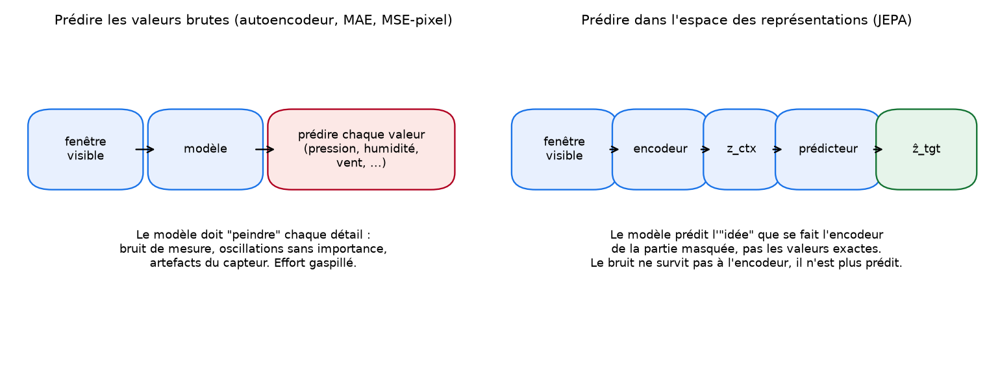
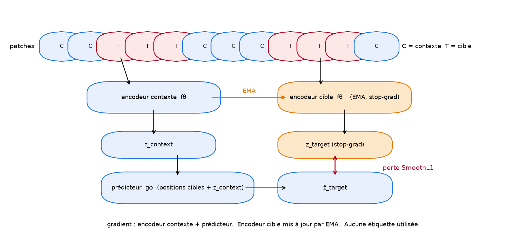

# Étape 4, JEPA en une image

À la fin de l'étape 3, on tient la promesse : prédire une partie de l'entrée à partir d'une autre, **dans l'espace des représentations plutôt que dans l'espace des données brutes**. Ici, on rend cette promesse concrète. On montre pourquoi elle change le problème, comment elle se traduit en modules d'un réseau de neurones, et surtout pourquoi elle peut échouer si on n'y fait pas attention.

## La phrase à retenir

> Un modèle JEPA prend deux morceaux d'un même signal, les encode chacun, et entraîne un prédicteur à retrouver la représentation du morceau caché à partir de celle du morceau visible.

Toute l'architecture, tout l'entraînement, tous les pièges se déduisent de cette phrase. On la déplie.

## L'analogie du roman

Imaginez qu'on vous fasse lire le début d'un roman policier, en cachant le chapitre 4. On vous pose deux tâches possibles.

- **Tâche A** : « Récrivez le chapitre 4 mot pour mot. » C'est une tâche de reconstruction. Vous allez perdre du temps à inventer des mots exacts qui n'ont aucune valeur ; l'auteur aurait pu choisir mille tournures équivalentes. Vous ne saurez jamais si votre chapitre est bon parce que vos mots ne sont pas les siens.
- **Tâche B** : « Décrivez, en trois phrases, ce que raconte probablement le chapitre 4 : qui parle, quels indices sont donnés, quelle atmosphère. » C'est une tâche de prédiction dans un **espace résumé**. Vous allez vous concentrer sur l'essentiel narratif. Vous ne perdrez pas d'énergie sur les détails.

La tâche B est celle de JEPA. La tâche A est celle des autoencodeurs et des modèles de type MAE. On voit intuitivement pourquoi la tâche B, avec un bon résumé, produit une meilleure compréhension du roman.

## Prédire les valeurs brutes, ou prédire dans le latent

Sur nos données capteur, prédire les valeurs brutes signifie forcer le modèle à reproduire :

- le bruit de mesure (fluctuations à haute fréquence sans signification),
- les oscillations diurnes exactes (qui sont un pattern fort mais **inutile pour la tâche** d'alerte),
- les artefacts électroniques (petits sauts, offsets).

Rien de tout cela n'a de valeur pour anticiper un orage. Mais l'objectif de reconstruction ne le sait pas, il pousse à tout reproduire à l'identique. Le budget du modèle est donc mal alloué.

Prédire dans l'espace latent revient à dire au modèle : « peu m'importe la valeur exacte du bruit à la 47e minute, dis-moi seulement à quoi ressemble le régime météo du morceau caché ». L'encodeur, en compressant, **élague** de lui-même le bruit et les rythmes prévisibles. Ce qui reste, dans `z`, est censé être **l'idée physique** du morceau, pas sa réalisation exacte. C'est cette idée qui est prédite.

## L'architecture, brique par brique

Six éléments à retenir. On les code un par un à l'étape 5.

### 1. Les patches

Une fenêtre est trop longue pour être traitée d'un coup par un transformer. On la découpe en morceaux de `L` pas de temps consécutifs, appelés **patches**. Une fenêtre de 96 pas et des patches de 8 pas donne 12 patches par fenêtre. Chaque patch devient un « jeton » que le transformer va manipuler.

C'est le même mouvement qu'en image (les patches d'un Vision Transformer) ou en texte (les tokens). En série temporelle, c'est TS-JEPA qui a popularisé cette découpe.

### 2. Le masquage

Sur les 12 patches, on choisit à l'avance lesquels sont visibles (le **contexte**) et lesquels sont cachés (la **cible**). Dans TS-JEPA on masque par blocs, typiquement deux blocs de trois patches. Les patches restants forment le contexte. Le taux de masquage est élevé (souvent > 50 %) : c'est ce qui rend la tâche difficile, donc informative.

Le masquage sert d'**oracle de la difficulté**. Sans lui, l'objectif serait trivial (l'encodeur pourrait tricher en copiant l'entrée). Avec lui, l'encodeur ne peut pas passer d'information de la cible au prédicteur autrement qu'en la calculant.

### 3. L'encodeur de contexte, `fθ`

Un transformer léger qui prend les patches visibles et en produit des embeddings `z_context`. C'est cet encodeur qu'on veut vraiment améliorer, c'est celui qu'on garde pour la sonde aval. Ses paramètres sont mis à jour par gradient standard.

### 4. L'encodeur cible, `fθ⁻`

Un transformer de même architecture, mais **ses paramètres sont une copie EMA** (moyenne mobile exponentielle) des paramètres de l'encodeur online. On ne le fait jamais avancer par gradient. C'est une astuce essentielle contre le collapse : le modèle online « poursuit » une cible mouvante et lente, ce qui empêche les deux encodeurs de dégénérer ensemble vers une solution triviale.

Formellement, à chaque pas :

$$\theta^{-} \leftarrow \tau \cdot \theta^{-} + (1 - \tau) \cdot \theta$$

avec par exemple `τ = 0.996`. Il faut plusieurs milliers d'étapes pour que `θ⁻` rattrape `θ`.

### 5. Le prédicteur, `gφ`

Un petit transformer (plus léger que les encodeurs) qui prend :

- les embeddings du contexte, `z_context`,
- **les positions** des patches cibles (des embeddings positionnels appris).

Il produit une **prédiction** de l'embedding de chaque patch cible : `ẑ_target`.

Le prédicteur est asymétrique : il n'existe que côté online, il n'a pas de miroir côté cible. Cette asymétrie est un deuxième rempart contre le collapse.

### 6. La perte

$$\mathcal{L} = \text{SmoothL1}(\hat{z}_{\text{target}}, \; \text{sg}(z_{\text{target}}))$$

où `sg(.)` est le stop-gradient : le côté cible ne reçoit jamais de gradient direct.

La perte est calculée **uniquement sur les patches cibles**, dans l'espace des embeddings. Elle est SmoothL1 plutôt que MSE : plus robuste aux valeurs extrêmes, et couramment utilisée dans les JEPA récents. Les cibles sont souvent passées par une LayerNorm pour éviter d'inciter l'encodeur cible à réduire son échelle (qui serait une forme de collapse).

## Le collapse, le piège qu'on ne peut pas ignorer

Rien dans la perte n'empêche la solution triviale suivante : **tous les embeddings sont le vecteur nul**. Dans ce cas, `z_context = 0`, `z_target = 0`, `ẑ_target = 0`, et la perte est parfaite. Sauf que le modèle n'a rien appris.

Toute la construction JEPA repose sur des mécanismes qui rendent cette solution instable :

- **L'encodeur cible EMA** : il change lentement. Si l'encodeur online veut « aller au zéro », le cible traîne derrière et la perte augmente pendant la transition. Le modèle est puni pour cette dégénérescence progressive.
- **L'asymétrie du prédicteur** : le prédicteur, qui est un transformer non trivial, casse la symétrie parfaite entre les deux encodeurs.
- **Le stop-gradient sur la cible** : sans lui, les deux encodeurs pourraient synchroniser leur collapse. Avec lui, seul l'online voit le gradient, et il doit « prédire » quelque chose qui n'est pas trivialement soi-même.
- **La LayerNorm sur la cible** : elle normalise l'échelle, ce qui empêche le collapse de « réduction d'échelle » (tout se contracte vers l'origine).

**Ces mécanismes ne sont pas décoratifs. Ils sont ce qui fait que JEPA marche.** Le collapse est le grand piège. À l'étape 6, on l'instrumentera avec un test automatique : on mesure l'écart-type et le rang de covariance des embeddings tout au long de l'entraînement, et on ferraille si ces valeurs s'effondrent.

## Comparaison rapide avec les paradigmes de l'étape 3

| Question                                        | Autoencodeur       | Contrastif           | JEPA                        |
|---                                              |---                 |---                   |---                          |
| Où est calculée la perte ?                      | Espace d'entrée    | Espace latent (cosinus) | Espace latent (SmoothL1)   |
| Le bruit est-il forcé d'être reproduit ?        | Oui                | Non (encodage)       | Non (encodage)              |
| A-t-on besoin d'augmentations sur mesure ?      | Non                | Oui, cruciales       | Non, le masquage suffit     |
| Combien de négatifs ?                           | Zéro               | Beaucoup             | Zéro                        |
| Risque de collapse ?                            | Faible             | Faible (les négatifs poussent) | Élevé, à surveiller |
| Coût de calcul par exemple                      | Modéré             | Élevé (grands batchs) | Modéré                     |

JEPA n'est pas magique. C'est un compromis explicite : on gagne en propreté et en efficience, on paye en vigilance contre le collapse.

## Ce qu'il faut retenir avant l'étape 5

1. JEPA masque une partie de l'entrée et prédit la représentation du morceau caché à partir de celle du morceau visible.
2. La prédiction se fait **dans l'espace latent**, ce qui élimine le bruit et les détails inutiles.
3. L'architecture repose sur six briques : patches, masquage, encodeur online, encodeur cible EMA, prédicteur, perte SmoothL1 en latent.
4. Le grand piège est le **collapse de représentation**, contré par un ensemble de mécanismes (EMA, stop-gradient, asymétrie du prédicteur, LayerNorm sur la cible).

À l'étape 5, on code chaque brique en PyTorch, en la testant isolément. On assemble à l'étape 6, on surveille le collapse, on entraîne. À l'étape 7, on juge, sans complaisance, si M1 bat M0.
