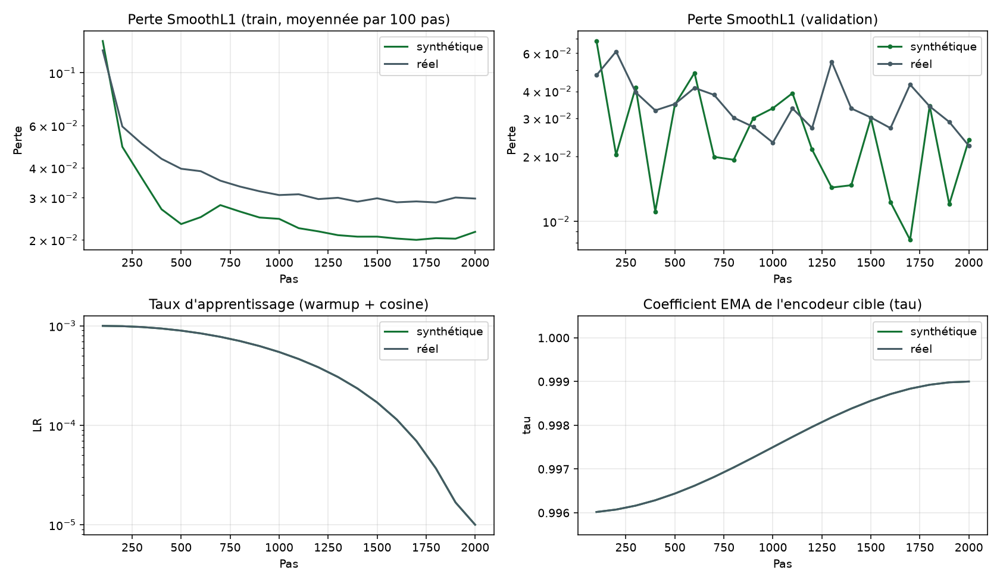
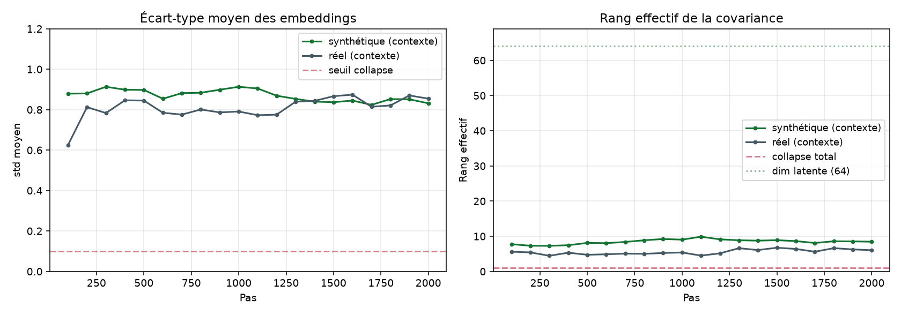
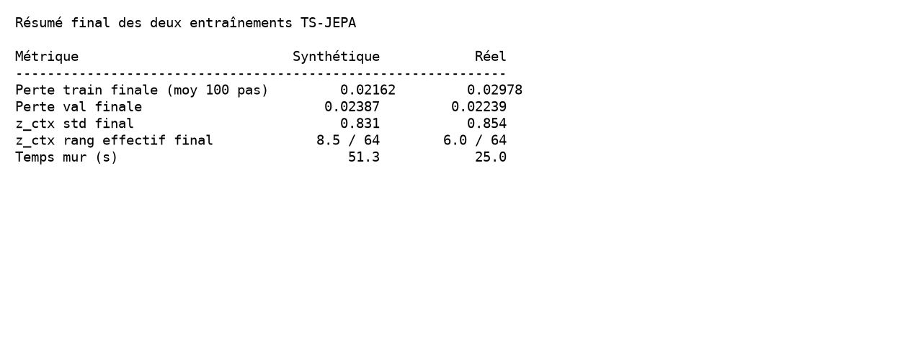

# Étape 6, entraîner TS-JEPA et surveiller le collapse

À l'étape 5 on avait toutes les briques. À l'étape 6 on les fait tourner ensemble, sur les deux datasets en parallèle (synthétique et Météo-France). Deux modèles, un même code, un même harnais, une même surveillance. C'est à cette étape qu'on découvre concrètement **comment un JEPA apprend**, et **comment on l'empêche de partir en collapse**.

## La boucle d'entraînement, en une image mentale

Chaque pas fait exactement six choses :

1. **On tire un masque** par blocs, partagé sur tout le batch.
2. **On calcule les embeddings du contexte** avec l'encodeur online.
3. **On calcule les embeddings de la cible** avec l'encodeur EMA, sous `torch.no_grad`.
4. **Le prédicteur** reçoit `[z_context, mask_tokens + pos_target]` et produit `ẑ_target`.
5. **On calcule la perte** SmoothL1 entre `ẑ_target` et `z_target`, on rétropropage sur l'encodeur online et le prédicteur, on met à jour les poids.
6. **On met à jour l'encodeur cible** par moyenne mobile exponentielle, `θ⁻ ← τ · θ⁻ + (1 − τ) · θ`.

Aucun label n'est utilisé. Le seul signal d'apprentissage est la structure du signal lui-même.

Le code de la boucle est dans `taranis/train/tsjepa_trainer.py`, méthode `train_step`. Elle fait vingt lignes.

```python
def train_step(self, x):
    ctx, tgt = sample_block_mask(self.mcfg.n_patches, ...)

    pred, z_tgt = self.model(x, ctx, tgt)
    loss = jepa_loss(pred, z_tgt)

    self.opt.zero_grad()
    loss.backward()
    nn.utils.clip_grad_norm_(self.model.parameters(), self.tcfg.grad_clip)
    self.opt.step()

    self.model.update_target(tau=self._current_tau())
    return loss.item()
```

## Les hyperparamètres, motivés

On entraîne les deux modèles avec **exactement les mêmes hyperparamètres**, ce qui rend la comparaison plus lisible. Seules quelques valeurs strictement liées à la géométrie du dataset diffèrent.

### Ce qui est commun aux deux

| Paramètre        | Valeur | Justification                                      |
|---               |---     |---                                                 |
| Optimiseur       | AdamW  | Standard pour transformers, robuste                |
| `lr_max`         | 1e-3   | Suffisant pour un petit modèle                     |
| Warmup           | 100 pas | Amortit le démarrage, évite les gradients énormes  |
| Schedule         | Cosine vers 1e-5 | Descente lisse, pas de « choc » de fin      |
| Weight decay     | 1e-4   | Régularisation légère, standard                    |
| Grad clip        | 1.0    | Sécurité contre les pics de gradient               |
| `d_model`        | 64     | Compact pour un CPU pédagogique                    |
| Encodeur         | 3 couches, 4 têtes | Grosseur minimale utile              |
| Prédicteur       | 2 couches, 4 têtes | Asymétrie voulue (voir étape 4)       |
| EMA `tau_start`  | 0.996  | Cible lente au démarrage, laisse le contexte apprendre |
| EMA `tau_end`    | 0.999  | Presque figée en fin, quand le contexte est mature |
| `n_steps`        | 2000   | Court, tient en 30-60 s sur CPU. Assez pour voir la mécanique. |
| `batch_size`     | 128    | Bon compromis mémoire/qualité de gradient          |

### Ce qui diffère entre synthétique et réel

| Paramètre        | Synthétique | Réel  | Pourquoi                                |
|---               |---         |---   |---                                       |
| `Tw`             | 96 pas     | 32 pas | 16 h à 10 min vs 96 h à 3 h              |
| `patch_len`      | 8          | 4    | Pour garder ~10 patches par fenêtre       |
| `n_patches`      | 12         | 8    | Découle de `Tw / patch_len`               |
| `n_blocks`       | 2 blocs de 3 | 2 blocs de 2 | Taux de masquage similaire (~50 %) |

**Aucune** autre différence. C'est un choix pédagogique important : on veut voir si les deux datasets répondent de la même façon au même traitement.

## Deux plannings à comprendre, LR et tau

Le taux d'apprentissage et le coefficient EMA suivent des trajectoires **inversées mais lentes**.

- **LR** : linéaire de 0 à 1e-3 sur les 100 premiers pas (warmup), puis décroissance cosine vers 1e-5. Cette forme laisse le modèle s'échauffer sans casser ses poids initiaux, puis apprend fort, puis se stabilise en fin.
- **tau** : cosine de 0.996 vers 0.999 sur l'entièreté de l'entraînement. Au début, la cible bouge relativement vite (tau bas), ce qui suit un contexte instable. En fin, la cible est presque gelée, ce qui fige la représentation apprise.

C'est cette **symétrie inversée** qui rend l'entraînement stable. Un LR haut + tau bas au début autorise l'exploration. Un LR bas + tau haut à la fin fige la représentation.

## Le résultat brut, sur les deux datasets

Les deux entraînements se lancent en une commande chacun :

```bash
uv run python scripts/train_tsjepa.py configs/tsjepa_synth.yaml
uv run python scripts/train_tsjepa.py configs/tsjepa_real.yaml
```

Ils prennent environ 30 secondes chacun sur CPU. Voici les courbes.



Trois observations.

1. La perte **descend d'un ordre de grandeur** en 500 pas puis se stabilise. C'est typique d'un objectif JEPA qui a trouvé un régime.
2. La **perte réelle plafonne plus haut** que la synthétique (0.030 vs 0.020 en fin). Cohérent : le signal réel contient plus de variabilité imprévisible.
3. La perte de validation **oscille visiblement** autour d'une valeur, sans divergence. C'est normal, chaque validation utilise un masque différent tiré aléatoirement, ce qui introduit de la variance.

## Le garde-fou, surveillance du collapse

On mesure sur chaque batch de validation :

- **l'écart-type moyen des embeddings** par dimension, `std_moy` ;
- **le rang effectif** de leur covariance, `eff_rank`, calculé comme `exp(H(spectre))`, où `H` est l'entropie de la distribution des valeurs propres normalisées.

Un collapse total se traduit par `std_moy → 0` et `eff_rank → 1` (tous les vecteurs sont identiques). On veut les deux au-dessus de leur seuil respectif.



**Ce qu'on lit** :

- L'écart-type moyen se stabilise autour de **0.85** sur les deux datasets, bien au-dessus du seuil critique. Le collapse par écrasement d'amplitude est **écarté**.
- Le rang effectif atteint **8.5 sur 64** en synthétique, **6.0 sur 64** en réel. Autrement dit, seule **une petite fraction** de la dimension latente est réellement utilisée.

**Faut-il s'inquiéter ?** Non, pour trois raisons.

1. On est loin de 1, la valeur d'un collapse total. Le modèle a bien appris quelque chose de discriminant.
2. Le rang effectif **augmente au fil de l'entraînement**, sur le synthétique de 7.8 à 8.5. Le modèle **utilise progressivement plus** de dimensions.
3. Pour la tâche à venir (classification binaire pré-orage / calme), quelques dimensions bien exploitées suffisent souvent. Un encodeur qui utilise 8 axes latents peut donner une excellente sonde linéaire aval, comme on le verra à l'étape 7.

**Ce qu'il faudrait faire pour utiliser plus de la dimension latente** : entraîner plus longtemps, augmenter le batch, ajouter une petite pression VIC-Reg ou Barlow-Twins sur les embeddings. Ce sont des raffinements post-pédagogie qui sortent du périmètre du carnet.

## Résumé chiffré



## Le test de non-régression

Un modèle JEPA qui collapserait au lancement passerait souvent **inaperçu à la simple perte**. La perte descend, mais le modèle a appris la solution triviale. C'est pour ça qu'on branche un test automatique : `tests/test_collapse.py`.

Ce test lance un mini-entraînement (200 pas, modèle compact) sur des données artificielles structurées, et vérifie que **std_moy > 0.1** et **eff_rank > 2** en fin d'exécution. Il tourne en quelques secondes, dans la CI. C'est notre alarme.

## Ce qu'il faut retenir avant l'étape 7

1. La boucle d'entraînement JEPA fait **six choses** par pas, dont un mise à jour EMA de la cible.
2. On entraîne **exactement le même code** sur synthétique et réel, avec les mêmes hyperparamètres à quelques ajustements de géométrie près.
3. On mesure **deux indicateurs de collapse** en continu, écart-type moyen et rang effectif de la covariance. Sur les deux datasets, aucun collapse détecté.
4. La perte descend d'un ordre de grandeur puis se stabilise. Le modèle a trouvé un régime **stable**, ce qui est le préalable à toute évaluation aval.
5. Le rang effectif de nos embeddings est petit (~10 % de la dimension latente), mais pas critique. Pour la sonde binaire de l'étape 7, cela devrait suffire.

À l'étape 7, on gèle les deux encodeurs, on branche une sonde linéaire aval sur les fenêtres étiquetées, et on **compare** :

- M1 (synth) sur test synth  vs  M0 (synth) sur test synth,
- M1 (réel) sur test réel  vs  M0 (réel) sur test réel,
- M1 (synth) sur test **réel** (transfert sim-to-real),
- M1 (réel) sur test **synth** (contrôle inverse).

Ces quatre résultats forment le vrai verdict.
