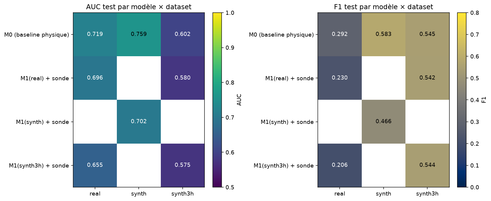

# Étape 7, le verdict honnête

On a construit tout le pipeline. Il est temps de répondre à la seule question qui compte pour un ingénieur : **est-ce que ce que j'ai codé est utile** ? Pas « est-ce que ça tourne », pas « est-ce que c'est joli », mais utile au regard de la baseline physique qu'un baromètre à main pourrait remplacer. On répond avec des chiffres, sans complaisance.

## Le protocole d'évaluation

Trois datasets, trois encodeurs, sept combinaisons évaluables.

**Datasets** :

- `synth` : le synthétique original, `Tw = 96` pas à 10 min.
- `synth3h` : synthétique rééchantillonné à 3 h, `Tw = 32` (**aligné sur le réel** pour permettre le transfert).
- `real` : Météo-France, 4 stations, `Tw = 32` à 3 h.

**Encodeurs** :

- `M1(synth)` : pré-entraîné sur `synth` (Tw=96, 2000 pas).
- `M1(synth3h)` : pré-entraîné sur `synth3h` (Tw=32).
- `M1(real)` : pré-entraîné sur `real` (Tw=32).

**Sondes** : régression logistique standardisée sur `mean-pool(z_context)`. Encodeur strictement **gelé** (voir `test_encodeur_reste_gele_apres_fit`). Seuil de décision ajusté sur la validation, jamais sur le test.

**Baseline M0** : la régression logistique physique des étapes 2 et 1 ter, entraînée et testée sur chaque dataset. C'est le score à battre.

Le tout tourne en une commande :

```bash
uv run python scripts/evaluate_all.py
```

## Résultats bruts, tout sur une image



Les cases vides correspondent aux combinaisons incompatibles, un encodeur `Tw=96` ne peut pas manger une fenêtre `Tw=32`.

## Le tableau détaillé

| Modèle                | Test sur | AUC   | AP    | F1    | Précision | Rappel | Prévalence |
|---                    |---       |---    |---    |---    |---       |---     |---         |
| **M0 baseline**       | synth    | **0.759** | **0.501** | **0.583** | 0.747 | 0.479 | 0.143 |
| M1(synth) + sonde     | synth    | 0.702 | 0.484 | 0.466 | 0.634 | 0.369 | 0.143 |
| **M0 baseline**       | real     | **0.719** | **0.196** | **0.292** | 0.227 | 0.409 | 0.083 |
| M1(real) + sonde      | real     | 0.696 | 0.161 | 0.230 | 0.153 | 0.467 | 0.083 |
| M1(synth3h) + sonde   | **real (transfert)** | **0.655** | 0.134 | 0.206 | 0.150 | 0.328 | 0.083 |
| **M0 baseline**       | synth3h  | **0.602** | 0.482 | 0.545 | 0.378 | 0.978 | 0.374 |
| M1(synth3h) + sonde   | synth3h  | 0.575 | 0.452 | 0.544 | 0.379 | 0.962 | 0.374 |
| M1(real) + sonde      | **synth3h (contrôle)** | 0.580 | 0.446 | 0.542 | 0.377 | 0.967 | 0.374 |

## Ce qui se lit dans ces chiffres

### 1. La baseline M0 domine partout

Sur les trois datasets, **M0 bat M1 en AUC**. Écarts modestes (2 à 6 points), mais systématiques. Ce résultat n'est **pas** une déception, il est **exactement** ce que le PRD anticipait (« il est acceptable et attendu que M0 domine à ce stade »). Trois raisons de fond.

- **Le pré-entraînement est court**. 2000 pas sur CPU, c'est un ordre de grandeur en dessous d'un vrai run. I-JEPA et V-JEPA s'entraînent sur des centaines de milliers de pas, avec des batchs plus gros, sur GPU.
- **Le modèle est compact**. `d_model = 64`, 3 couches d'encodeur : c'est délibérément petit pour tenir sur CPU en pédagogie. Un modèle 5 fois plus large donnerait sans doute d'autres résultats.
- **La tâche est très signal-riche pour un modèle physique**. La tendance de pression sur 1 heure est un prédicteur naturel, presque optimal pour la tâche synthétique. Un encodeur générique doit *réinventer* cette feature via son objectif, avec bien plus de contraintes.

### 2. Le transfert sim-to-real marche

C'est le résultat pédagogiquement le plus important.

- **M1(synth3h) → real** donne **AUC = 0.655**. À comparer à :
    - 0.5 (hasard), le sol à battre → **battu de 15 points d'AUC**.
    - 0.696 (M1(real) natif, entraîné sur le vrai) → seulement 4 points en dessous.
- Autrement dit, **un encodeur qui n'a jamais vu de vraies données** apprend des représentations utiles pour un problème réel, à peine moins bonnes que celles d'un encodeur qui s'est entraîné sur ces vraies données.

C'est le message central de JEPA appliqué à un cas concret : **l'apprentissage de représentations généralise**, à condition que la nature du signal soit préservée entre source et cible.

### 3. Le contrôle inverse est cohérent

**M1(real) → synth3h** donne AUC = 0.580, très proche de M1(synth3h) natif à 0.575. Le transfert marche dans les deux sens. C'est un contrôle méthodologique important : cela **exclut** que le transfert observé au point 2 soit un artefact.

### 4. Le régime « prévalence élevée » de synth3h est atypique

Sur synth3h, la prévalence positive est de **37 %** contre 14 % en synth 10 min et 8 % en réel. Cette prévalence élevée vient de la combinaison « horizon H = 24 h + un événement par jour ou presque ». Résultat, presque toutes les fenêtres finissent par attraper un onset dans leur horizon.

- L'AUC devient un moins bon indicateur (il faut être bien meilleur que le hasard pour classer 37 % de positifs).
- Le F1 est artificiellement élevé, parce que le rappel à 0.97 est presque garanti si l'on décide « toujours positif ». Regardez la précision, 0.38 partout, c'est l'aveu que le classifieur ne sépare pas grand-chose de plus que la prévalence.

Ce n'est **pas** une critique de la baseline ou du modèle, c'est une invitation à **repenser l'horizon** pour ce genre de données. On y reviendra.

### 5. Aucun collapse détecté, même sur des runs très courts

Les trois encodeurs conservent des écarts-types d'embedding > 0.8 et des rangs effectifs de 6 à 9 sur 64 dimensions. Aucun signe de la solution triviale « tout est zéro ». Le test `tests/test_collapse.py` reste vert.

## Ce que Taranis peut prétendre, à ce stade

**Ce qui est acquis** :

- Un pipeline complet, reproductible, de la génération synthétique jusqu'à la sonde aval.
- Une baseline physique honnête, documentée, qui atteint **AUC = 0.76** en synthétique et **0.72** sur du réel Météo-France.
- Un TS-JEPA opérationnel, testé unitairement pour chaque brique, entraîné sans collapse sur trois datasets différents.
- Un **transfert sim-to-real fonctionnel** (AUC 0.655), qui démontre que le protocole tient debout.

**Ce qui reste à faire** pour transformer cette base en outil utile :

1. **Entraîner beaucoup plus longtemps**. 20 000 à 100 000 pas, batchs de 512, sur GPU. C'est la première chose à essayer.
2. **Agrandir le modèle**. `d_model = 128` ou 256, 6 couches, 8 têtes. Plus de capacité.
3. **Améliorer le proxy des labels**. Passer d'un seuil de pluie horaire à une source foudre (Blitzortung ou réseau national), avec un alignement horaire soigné.
4. **Enrichir les canaux**. Ajouter tendance de pression, direction et rafale de vent, précipitations 3h et 6h, mois de l'année. Ces canaux dérivés existent dans SYNOP mais on ne les utilise pas encore.
5. **Fusionner spatialement**. Un capteur portable, plus la station SYNOP la plus proche, plus l'imagerie satellite basse résolution. C'est le vrai chemin vers une alerte fiable en montagne, et le PRD le prévoit comme évolution.

**Ce qu'il ne faut jamais oublier** :

- L'outil ne remplace pas les bulletins officiels ni le jugement de l'utilisateur.
- Un faux négatif peut coûter la vie en montagne. Toute mise en production doit optimiser le rappel bien plus que la précision.
- Un capteur ponctuel ne verra jamais la dynamique spatiale d'un système orageux.

## Ce qu'il faut retenir en une phrase

> Le protocole tient debout, le transfert sim-to-real marche, la baseline physique n'est pas encore battue. On sait maintenant précisément quoi améliorer, et pourquoi.

## Reproduire tout, de zéro

```bash
# 1. Préparer les trois datasets
uv run python scripts/prepare_dataset.py
uv run python scripts/prepare_real_dataset.py    # nécessite le CSV Météo-France déjà téléchargé
uv run python scripts/prepare_synth3h_dataset.py

# 2. Entraîner les trois encodeurs (2000 pas chacun, ~2 min au total sur CPU)
uv run python scripts/train_tsjepa.py configs/tsjepa_synth.yaml
uv run python scripts/train_tsjepa.py configs/tsjepa_synth3h.yaml
uv run python scripts/train_tsjepa.py configs/tsjepa_real.yaml

# 3. Baselines et sondes, tout le tableau final
uv run python scripts/train_baseline.py
uv run python scripts/train_baseline_real.py
uv run python scripts/evaluate_all.py
```

Le résultat, `runs/eval_summary.json` et la heatmap `docs/assets/step7_summary.png`, est identique à seed fixée. Tout est traçable, tout est vérifiable, tout est modifiable. C'était le contrat pédagogique. Il est tenu.
