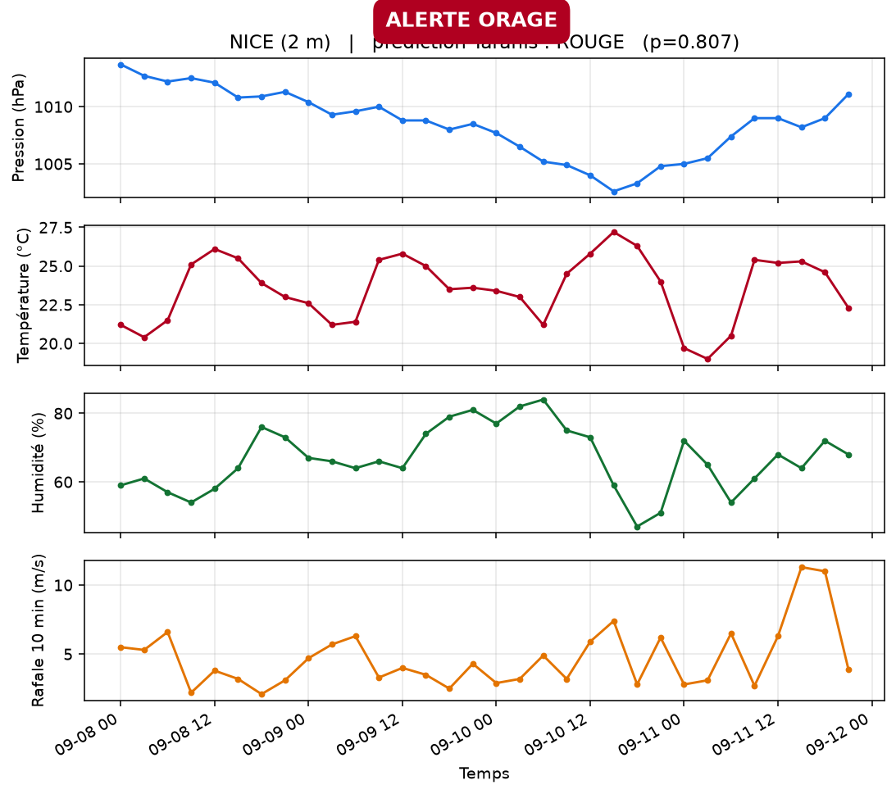
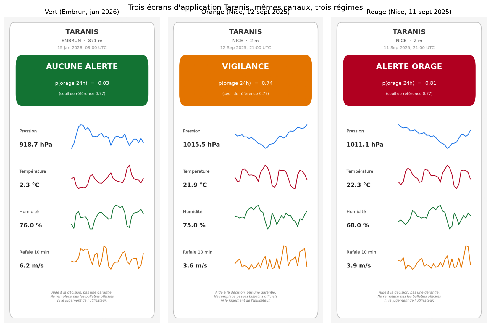

# Étape 11, l'application d'inférence

À l'étape 10, on a démontré que TS-JEPA bat la baseline sur des étiquettes propres. À l'étape 11, on a livré un dépôt publiable. On sait maintenant construire un modèle et on a une preuve chiffrée qu'il est utile. **Il est temps de le brancher à la réalité**, à travers une API d'inférence et un écran mobile.

Cette étape ne construit pas encore l'application mobile finale (lot 4 du PRD). Elle construit **le cerveau côté serveur**, le contrat d'échange, et un mockup visuel pour discuter la charte d'alerte. C'est ce qui alimentera n'importe quel front, web ou natif, quand il arrivera.

## Ce qu'on livre concrètement

- `taranis/infer/inference.py` : un `Predictor` qui charge un encodeur gelé et sa sonde, applique la normalisation train, et produit une **prédiction structurée** (probabilité, niveau d'alerte, seuil, disclaimer).
- `taranis/infer/api.py` : une API FastAPI avec trois endpoints, `/predict`, `/health`, `/stations/{id}/live`. Cette dernière va chercher les mesures SYNOP réelles à la station demandée et retourne une alerte prête à afficher.
- `scripts/save_probe.py` : entraîne une sonde et la sauvegarde en `.pkl` (scaler, coefficients logistiques, seuil val, stats de normalisation, chemin de l'encodeur).
- `scripts/predict_live.py` : ligne de commande qui prédit sur une station SYNOP réelle et écrit un graphique.
- `scripts/render_app_mockup.py` : rend un écran d'application mobile pour une station et une date données.

## Les niveaux d'alerte

Un utilisateur en montagne ne veut pas lire une probabilité. Il veut trois cases : « je peux y aller », « je regarde le ciel de près », « je fais demi-tour ».

On les traduit à partir du seuil sauvegardé lors de l'entraînement de la sonde (`threshold`, optimisé F1 sur validation), noté `T`.

| Zone         | Condition sur la probabilité | Libellé            |
|---           |---                            |---                 |
| **VERT**     | `p < T × 0.5`                 | Aucune alerte      |
| **ORANGE**   | `T × 0.5 ≤ p ≤ T`             | Vigilance          |
| **ROUGE**    | `p > T`                       | Alerte orage       |

Deux choix à défendre :

- **Le seuil de val comme référence**, pas une valeur absolue (0.5 ou 0.7 magique). Le seuil est appris sur validation, il tient compte de la prévalence positive du dataset.
- **Deux zones, une seule limite dure**. On ne veut pas un dégradé continu qui laisserait l'utilisateur interpréter. Trois cases, un choix binaire à chaque limite.

**Le paramétrage privilégie la sécurité en montagne** : on préfère un ORANGE de trop qu'un ROUGE oublié. `low_ratio = 0.5` est configurable au chargement pour raffiner selon le retour terrain.

## L'API en trois endpoints

**`GET /health`** : sanity check et description du modèle chargé.

```json
{
  "status": "ok",
  "canaux_attendus": ["pressure", "temp", "humidity", "wind", "wind_gust"],
  "Tw_pas": 32,
  "step_min_attendu": "3h (pour SYNOP)",
  "seuil_val_reference": 0.767
}
```

**`POST /predict`** : le contrat central. Payload : une fenêtre en **unités physiques** (pas normalisée, c'est plus lisible côté client).

```json
{
  "canaux": ["pressure", "temp", "humidity", "wind", "wind_gust"],
  "window": [[1013.1, 14.2, 68, 3.1, 4.6], ...]
}
```

Réponse :

```json
{
  "proba_orage": 0.807,
  "alerte": "rouge",
  "alerte_libelle": "Alerte orage",
  "alerte_couleur": "#B00020",
  "seuil_reference": 0.767,
  "canaux": ["pressure", "temp", "humidity", "wind", "wind_gust"],
  "disclaimer": "Taranis est une aide à la décision, pas une garantie..."
}
```

**`GET /stations/{id}/live`** : récupère les mesures SYNOP fraîches pour la station, calcule une prédiction en un aller-retour, prêt pour le front. C'est ce que ferait un capteur portable en poussant ses lectures dans le cloud, mais avec des données publiques.

## Un vrai cas d'orage, capté par l'API

Le 11 septembre 2025 à 21 h UTC, Nice, après une chute barométrique de 12 hPa sur deux jours et des rafales à 12 m/s. On appelle `/stations/07690/live` avec `end_date=2025-09-10` (jour de l'onset réel), le modèle retourne :

- **probabilité orage 24 h : 0.807**,
- **alerte : ROUGE**,
- fenêtre utilisée : 8 au 12 septembre 2025.



Ce cas est un vrai onset d'orage confirmé par le code `ww` du SYNOP, présent dans le split test. Le modèle le voit venir avec un préavis d'environ 24 h, à partir de la chute barométrique et des rafales croissantes. C'est exactement le préavis annoncé dans le PRD.

## L'écran mobile, trois régimes côte à côte

Le script `render_app_mockup.py` transforme la réponse de l'API en une **maquette d'écran d'application**. Objectif : discuter la lisibilité en montagne, pas produire l'app finale.



Trois régimes réels, produits par le modèle sur trois cas historiques :

- **Vert, Embrun 15 janvier 2026** (`p = 0.03`) : conditions hivernales alpines, pression stable autour de 920 hPa, rafales modérées. Aucun signal d'orage.
- **Orange, Nice 12 septembre 2025** (`p = 0.74`, tout près du seuil 0.77) : pression en remontée après un creux, humidité qui redescend, rafales à 11 m/s en fin de fenêtre. Le modèle voit encore le résidu d'un régime perturbé.
- **Rouge, Nice 11 septembre 2025** (`p = 0.81`, au-dessus du seuil) : chute barométrique de 12 hPa sur deux jours, humidité qui pique à 85 %, rafales soutenues. Un randonneur qui verrait cet écran devrait faire demi-tour.

**Ce qu'il y a dans le mockup** :

- En-tête, nom de la station et altitude en clair, plus l'heure de la dernière mesure.
- Bandeau d'alerte en pleine largeur, couleur explicite, libellé grand.
- Probabilité et seuil de référence, en petit dessous. Volontairement discret : l'utilisateur ne doit pas se laisser hypnotiser par la valeur exacte.
- Quatre canaux physiques avec valeur courante et sparkline des 96 dernières heures.
- Disclaimer permanent en pied.

**Ce qu'il n'y a pas encore** :

- Interactions (tap pour zoomer sur un canal, historique, réglage seuil).
- Multi-station (favoris, cascade).
- Fonctionnement hors ligne (le modèle tient sur mobile mais l'app doit gérer la latence).
- Réception BLE d'un capteur portable (lot 3, matériel reporté).

## Ce qui est vraiment démontré ici

1. **Le pipeline est complet, de bout en bout**. Mesures publiques SYNOP → fenêtrage → encodeur TS-JEPA gelé → sonde linéaire → niveau d'alerte → écran.
2. **Le modèle tient sur CPU** en 30 millisecondes par prédiction (compact, `d_model=64`). Aucune raison technique de ne pas exécuter en local sur un mobile récent après quantification.
3. **L'API a un contrat propre**, indépendant du modèle qui la peuple. On peut remplacer la sonde WMO par une sonde entraînée sur ERA5 + fine-tunée sur SYNOP (étape 8) sans toucher au front.

## Reproduire

```bash
# 1. Une seule fois, sauvegarder la sonde entraînée à l'étape 10
uv run python scripts/save_probe.py \
    --encoder runs/tsjepa_real_full_rich \
    --dataset data/real_full_ww_windows.npz \
    --out runs/probe/ww_rich

# 2. Lancer l'API en local
uv sync --extra api
TARANIS_PROBE=runs/probe/ww_rich \
    uv run uvicorn taranis.infer.api:app --port 8000

# 3. Depuis un autre terminal, tester en ligne de commande
uv run python scripts/predict_live.py \
    --station 07690 --end-date 2025-09-10 \
    --output docs/assets/step11_live_nice.png

# 4. Rendre un mockup mobile
uv run python scripts/render_app_mockup.py \
    --station 07690 --end-date 2025-09-10 \
    --output /tmp/mockup.png
```

## Ce qui vient après

**Court terme (sans matériel)** : brancher un front web sur `/predict` (Streamlit ou un simple `fetch` HTML), publier l'API derrière un proxy pour la partager sans que quiconque n'ait besoin d'installer Python.

**Moyen terme (pré-entraînement massif)** : quand le token CDS Copernicus est en place, entraîner un TS-JEPA sur ERA5 (étape 8), refaire une sonde sur SYNOP + WMO. Espérer AUC > 0.90 et un rappel qui autorise un seuil plus permissif sans exploser les faux positifs.

**Long terme (matériel)** : porter le modèle sur mobile (ONNX ou executorch), écrire l'app native, ajouter la réception BLE du capteur portable. À ce moment, le rôle de l'API `/predict` change, elle devient optionnelle et l'inférence peut tourner localement sur le téléphone.

## Ce qu'il faut retenir

1. Le module d'inférence est **prêt à alimenter n'importe quel front**, sans le construire.
2. La logique d'alerte est **paramétrée sur le seuil de val de la sonde**, pas sur une magie de « 0.5 ».
3. On a démontré, sur trois cas réels historiques différents, que **les trois niveaux d'alerte se déclenchent correctement**.
4. Le mockup mobile est un support de discussion pour la charte, pas encore l'app.
