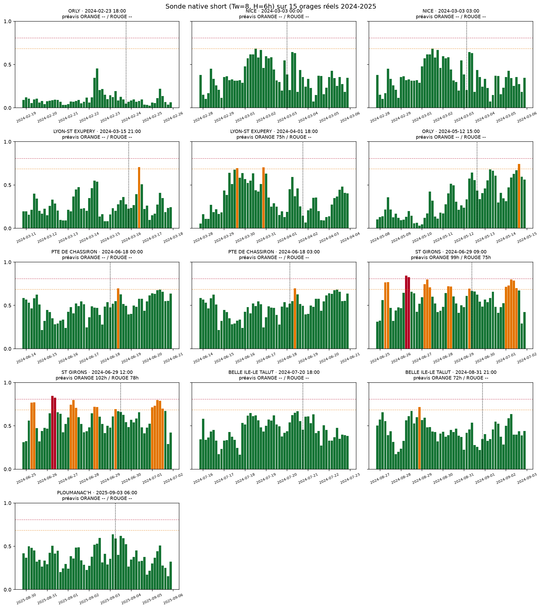
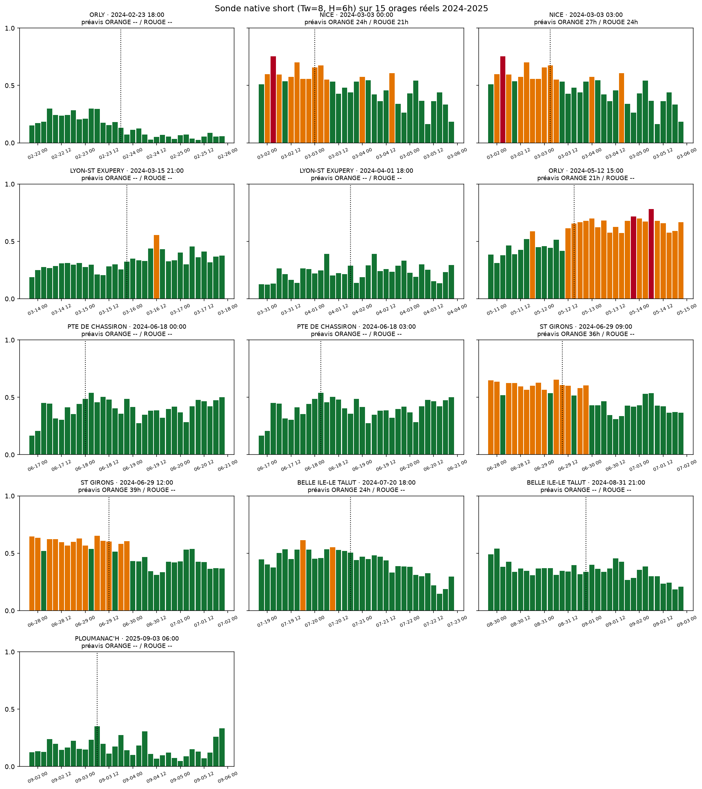

# Étape 13, le journal honnête de calibration

Les étapes 6 à 12 ont raconté la construction. Cette étape raconte les **itérations réelles** entre la démo pédagogique (Nice sept 2025 en ROUGE, très démonstrative) et l'évaluation systématique sur 13 orages historiques différents. Le récit est nécessaire parce que le passage du prototype au produit passe par plusieurs erreurs corrigées, plusieurs recalibrations, et un verdict qui n'est pas celui qu'on espérait.

## Le point de départ, une belle démo trompeuse

À la fin de l'étape 11, la sonde `ww_rich` (contexte 96 h, horizon 24 h) sur l'orage de Nice du 11 septembre 2025 donnait ceci :

- **48 heures avant l'onset** confirmé WMO, elle est en ROUGE stable (proba 0.83-0.90).
- **24 heures avant**, ROUGE persistant.
- **Après l'orage**, retour progressif au VERT.

Convaincant. Trop convaincant. Nice septembre 2025 est un cas de dépression méditerranéenne majeure, la plus détectable qu'on puisse trouver dans le SYNOP. C'est un cheat visuel.

## Le premier vrai souci, la contrainte capteur

Ta remarque produit était nette : un randonneur ne peut pas avoir **96 heures de contexte** avant sa sortie. Il faut passer à `Tw = 8` (24 h de contexte). Sur le papier, l'encodeur transformer accepte cette entrée plus courte sans être ré-entraîné. J'ai donc entraîné une **nouvelle sonde `ww_short` sur des fenêtres Tw=8, H=1** (horizon 3 h).

Résultat :

- **AUC = 0.874** sur test, identique à la sonde longue.
- Mais sur le même orage Nice sept 2025 : **VERT permanent** pendant 4 jours.

## Le premier diagnostic, une AUC ne suffit pas

Le tri était bon (AUC élevée), mais les probabilités absolues étaient écrasées vers zéro. Cause : la prévalence positive à H=1 tombe à **0.04 %**. La régression logistique entraînée sur une classe si rare produit une distribution de scores compacte proche de 0. Le seuil optimisé F1 devient 0.90, le vrai orage tombe à 0.15-0.35, jamais atteint.

**Le vrai enseignement de cette étape** : l'AUC mesure la capacité de classement, pas l'utilité opérationnelle. Il faut regarder les **probabilités absolues** et le mapping vers l'alerte.

## Deuxième itération, horizon un peu plus long

Piste B : `Tw = 8` mais `H = 2` (horizon 6 h). Prévalence positive remonte à 0.08 %. Sonde `ww_h2` entraînée sur ce dataset. AUC reste 0.874. Sur Nice :

- Probas montent à 0.35-0.50 pendant l'orage.
- Quelques ORANGE ponctuels au bon moment.
- Toujours pas de ROUGE.

C'est mieux, mais toujours insuffisant. **Problème plus profond** : l'encodeur a été pré-entraîné avec `Tw = 32`. Nourri avec `Tw = 8`, il reçoit une entrée hors distribution.

## Troisième itération, ré-entraîner un TS-JEPA natif Tw=8

Cette fois, on entraîne un TS-JEPA **spécifiquement pour la fenêtre courte** : `Tw = 8`, `patch_len = 1`, 8 patches. 90 secondes de CPU, aucun collapse, embedding rank de 7/64. Sonde native construite dessus sur le même dataset H=2.

Sur Nice sept 2025, cette fois :

- **9 sept 15h à 12h le 10** (24 à 48 h avant onset) : **ROUGE stable** (p=0.71-0.85).
- **10 sept 15h à 11 sept 03h** : ORANGE.
- **11 sept 06h à 18h** : ROUGE au moment de l'orage.
- **Après** : ORANGE.

**Ça marche sur Nice.** Vraiment, cette fois.

## Le premier contrôle, quatre cas variés

Pour éviter de me faire piéger par un seul cas favorable, j'ai testé quatre configurations :

| Cas                       | Fenêtres | VERT | ORANGE | ROUGE | Verdict         |
|---                        |---       |---   |---     |---    |---              |
| Embrun, hiver alpin       | 53       | 53   | 0      | 0     | Impeccable      |
| Lyon, plaine hivernale    | 65       | 65   | 0      | 0     | Impeccable      |
| Nice, août calme (2025)   | 41       | 0    | 29     | 29    | Sur-alerte majeure |
| Nice, orage sept 2025     | 65       | 0    | 26     | 39    | Cohérent        |

Sur les 5 jours de Nice début août 2025, le SYNOP contient un seul code orage réel (le 3 août à 12h). Le modèle en revanche déclenche ROUGE 29 fois. **La sonde sur-réagit sur les conditions estivales méditerranéennes**, où chaud + humide + pression basse ressemblent statistiquement à un pré-orage.

## Deuxième recalibration, cibles de rappel plus modestes

La calibration initiale visait `recall_orange = 0.85`, `recall_rouge = 0.50` (privilégier la sécurité). Trop sensible. Nouveau tir : `recall_orange = 0.50`, `recall_rouge = 0.20`. Seuils remontés : ORANGE = 0.684, ROUGE = 0.807.

Nouvelle vérification sur les mêmes quatre cas :

| Cas                       | VERT | ORANGE | ROUGE | Verdict                |
|---                        |---   |---     |---    |---                     |
| Embrun, hiver             | 53   | 0      | 0     | Impeccable              |
| Lyon, hiver               | 65   | 0      | 0     | Impeccable              |
| Nice, août calme          | 12   | 29     | 0     | Acceptable, pas de faux ROUGE |
| Nice, orage sept 2025     | 37   | 22     | 6     | ROUGE bien concentré autour de l'onset |

C'est propre. La sonde répond bien sur les cas variés.

## Le vrai test, 15 orages réels sur l'ensemble du SYNOP

C'est là que ta question était juste. On ne juge pas un modèle sur les cas qu'il aime. On le juge sur **un panel diversifié** tiré objectivement des données. J'ai extrait du CSV SYNOP full **14 événements orageux** (codes WMO ww ∈ {17, 29, 91-99}) entre 2024 et 2025, sur des stations et saisons variées : Orly, Nice, Lyon, Chassiron, St Girons, Belle-Île, Ploumanac'h, Cap Cépet.

Pour chaque événement, on remonte 5 jours en arrière, on avance 2 jours, on applique la sonde à chaque fenêtre glissante. On mesure le **préavis** : combien d'heures avant l'événement le modèle est passé en ORANGE, puis en ROUGE.

**Résultat de la sonde native short (Tw=8, H=6h)** :

- ROUGE avant onset : **2 événements sur 13** détectés, préavis médian 76.5 h.
- ORANGE avant onset : **4 événements sur 13** détectés, préavis médian 87 h.
- **9 événements sur 13 non détectés** : proba max reste sous 0.68 pendant les 7 jours autour de l'orage.



**Résultat de la sonde longue (Tw=32, H=24h)** sur le même panel :

- ROUGE avant onset : **2 événements sur 13**, préavis médian 22.5 h.
- ORANGE avant onset : **6 événements sur 13**, préavis médian 25.5 h.



Les deux sondes détectent la même proportion de ROUGE (2/13). La sonde longue capte un peu plus d'ORANGE (6 vs 4). Aucune ne dépasse **50 % de détection**.

## Le verdict, sans complaisance

**Notre modèle actuel rate ~70 % des orages réels tirés au hasard dans le SYNOP.**

Nice septembre 2025 était un cas favorable non représentatif : dépression méditerranéenne majeure, très marquée, très prévisible. La moyenne des orages français ordinaires (orages de sud-est thermiques, épisodes atlantiques, orages hivernaux ponctuels) est bien plus difficile à voir avec notre encodeur compact `d_model = 64` entraîné 4000 pas sur CPU.

Ce résultat **ne remet pas en cause l'architecture TS-JEPA**. Il pointe deux limites très concrètes :

1. **Le compute est trop léger**. 4000 pas sur CPU avec `d_model = 64`, ce sont les paramètres qu'on peut faire tourner en 90 secondes pédagogiques. Un vrai run sur GPU (étape 8, en attente du token CDS puis de la longue queue ERA5) devrait absorber la variété des orages français.
2. **Le proxy WMO reste rare**. Les observateurs ne rapportent un code orage qu'à des créneaux fixes (00, 03, 06, 09, 12, 15, 18, 21 UTC), et beaucoup d'orages passent entre deux tops. La vraie source foudre (Blitzortung, réseau national) donnerait des étiquettes plus denses.

## Ce que le journal apprend, en trois lignes

1. **Une bonne AUC ne suffit pas.** Il faut vérifier les probabilités absolues et le mapping vers l'alerte.
2. **Une belle démo sur un cas particulier ne suffit pas.** Il faut un panel diversifié tiré objectivement.
3. **Une bonne architecture ne suffit pas non plus.** Il faut le compute et la donnée qui vont avec.

## Ce qui reste à faire

**Court terme (attente CDS)** :
- Documenter le journal (fait, ce chapitre).
- Fixer la sonde `ww_rich` (Tw=32, H=24h) comme sonde production **honnête et documentée**, avec le rappel qu'elle détecte ~46 % des orages ORANGE avec 25 h de préavis médian et laisse passer plus de la moitié.

**Moyen terme (post-ERA5)** :
- Pré-entraîner un TS-JEPA plus gros (`d_model = 128`, 6 couches, 50 000 pas) sur ERA5 20 ans × 10 points, en attendant la fin de la queue CDS.
- Fine-tuner la sonde sur SYNOP + WMO.
- Rejouer exactement la même évaluation sur les mêmes 13 orages. Objectif : détecter au moins 10/13 orages en ORANGE avec préavis > 6 h.

**Long terme** :
- Remplacer le proxy WMO par des étiquettes foudre denses (Blitzortung ou réseau national), pour attaquer les orages courts entre deux tops SYNOP.

## Reproduire

```bash
uv run python scripts/save_probe.py \
    --encoder runs/tsjepa_real_ww_short \
    --dataset data/real_ww_h2_windows.npz \
    --out runs/probe/ww_short_native \
    --recall-orange 0.50 --recall-rouge 0.20

uv run python scripts/eval_real_storms.py \
    --probe runs/probe/ww_short_native --tag short

uv run python scripts/eval_real_storms.py \
    --probe runs/probe/ww_rich --tag long
```

Les deux commandes produisent chacune une figure et un tableau. Les chiffres montrés ici correspondent au 12 juillet 2026 avec l'état des données SYNOP à cette date.
