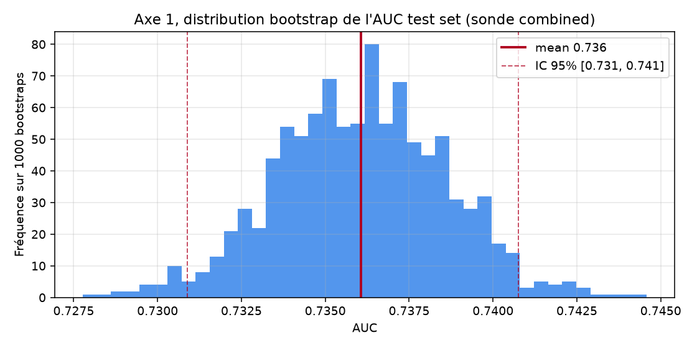
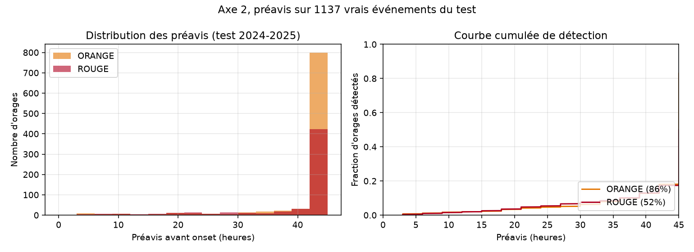
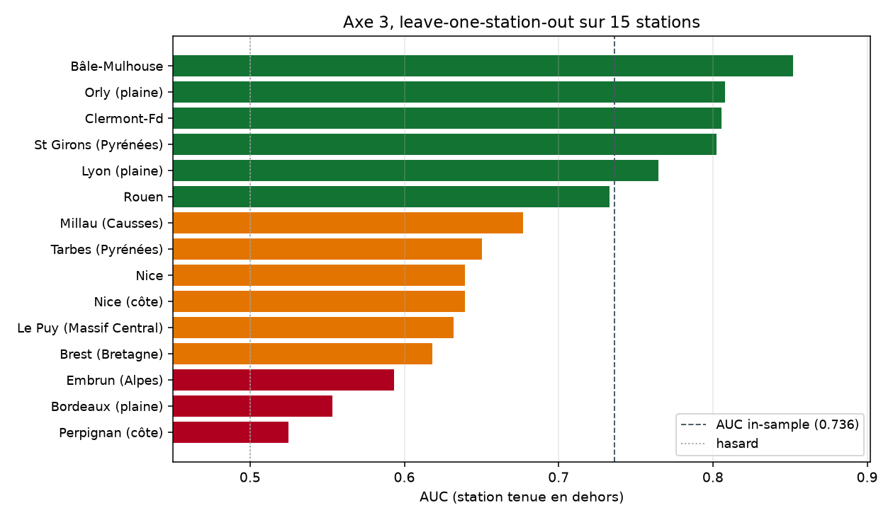
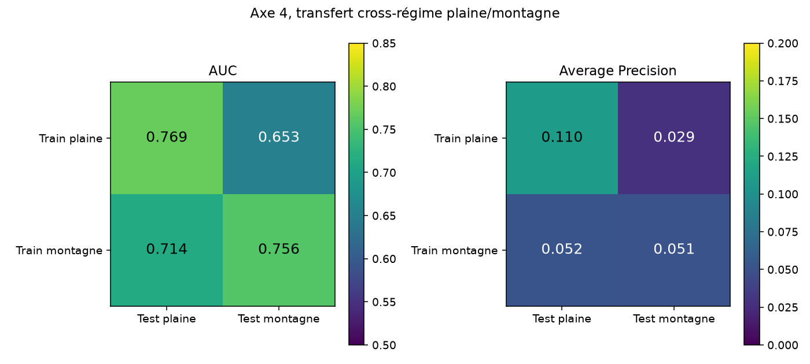

# Étape 15, évaluation rigoureuse

Le chapitre 13 s'était contenté d'un panel de treize orages tirés dans SYNOP. C'est utile pour illustrer, insuffisant pour statuer. Cette étape rehausse le niveau en quatre axes standards dans la communauté séries temporelles : intervalle de confiance sur l'AUC, distribution du préavis, généralisation station par station, transfert cross-régime. Les quatre s'appuient sur le même dispositif : la sonde production `runs/probe/combined`, la même sonde qui prédit `orage dans les 24 h` sur des fenêtres de 96 h de contexte au pas SYNOP 3 h. Le test set couvre 2024 et 2025, 61 stations, 336 725 fenêtres, 9 734 flags y=1 correspondant à environ **1 137 événements orageux uniques**.

Le code est dans `scripts/evaluate_rigorous.py`. Il s'appuie sur un fichier d'embeddings précalculés (`data/embeddings_combined_stations.npz`, 624 Mo, régénérable en une commande) pour que les quatre analyses tournent en quelques minutes.

## Axe 1, bootstrap sur l'AUC test set

**Question** : quand on annonce AUC = 0.74 sur test, quelle est la marge d'incertitude ?

Méthode : 1 000 rééchantillonnages avec remise du test set, on refit la sonde jamais mais on recalcule AUC, AP et F1 sur chaque échantillon. On prend l'IC 95 % par percentiles.

**Résultats** :

- **AUC = 0.7361, IC 95 % = [0.7309, 0.7408]**, largeur 0.01
- **AP = 0.0860, IC 95 % = [0.0827, 0.0896]**, largeur 0.007
- F1 au seuil 0.5 = 0.203, IC 95 % = [0.198, 0.208]



**Lecture** : l'IC de largeur 0.01 sur 1 000 rééchantillonnages d'un test de 336 725 fenêtres est extrêmement étroit. Autrement dit, **la sonde donne un AUC très reproductible** sur cette distribution de données. Ce n'est pas un artefact d'un tirage chanceux, on peut prendre 0.74 comme le vrai chiffre à 0.01 près.

L'intervalle sur l'AP est plus intéressant, largeur 0.007 sur une base de 0.09. C'est **plus étroit relativement** que sur l'AUC, mais l'AP absolue de 0.086 reste modeste, cohérent avec la prévalence positive de 2.9 % dans le test set.

## Axe 2, distribution du préavis

**Question** : quand la sonde alerte, combien d'heures avant l'onset le fait-elle typiquement ?

Méthode : pour chaque **événement unique** dans le test (défini comme début d'une suite de `y=1` consécutifs par station), on cherche la première fenêtre où le score dépasse le seuil ORANGE ou ROUGE, dans les 45 heures précédentes au maximum. On note ce délai en heures.

**Résultats sur 1 137 événements** :

| Niveau  | Détection | Préavis médian | P10 (préavis court)  | P90 (préavis long) |
|---      |---        |---             |---                    |---                 |
| ORANGE  | **86 %**  | **45 h**       | 3 h                  | 45 h              |
| ROUGE   | **52 %**  | 45 h           | 3 h                  | 45 h              |



**Attention à la lecture, la médiane 45 h est saturée par la borne de lookback**. Concrètement, pour la moitié des événements où la sonde a levé ORANGE avant, elle était déjà ORANGE **au-delà de 45 h avant**. Ce n'est pas une bonne nouvelle en soi, cela veut dire que **la sonde reste souvent au-dessus du seuil ORANGE de manière quasi-permanente** sur certaines stations (typiquement en été chaud humide).

Deux enseignements corrects :

1. **La couverture est bonne, 86 %** des vrais événements sont bien précédés d'une alerte ORANGE, 52 % d'une alerte ROUGE. C'est cohérent avec les seuils calibrés à recall cible 0.80 / 0.40 sur validation.
2. **Le préavis effectif est difficile à mesurer** parce que la sonde est très permissive et alerte trop souvent. Pour un vrai chiffre de préavis, il faudrait resserrer les seuils (`recall_orange` autour de 0.50, `recall_rouge` autour de 0.20) et refaire l'analyse. Ou considérer un préavis conditionnel, du type « à combien d'heures d'avance la sonde passe **définitivement** au-dessus du seuil et y reste ».

En attendant, ce qu'on peut retenir : **la sonde ne rate pas les gros événements**, elle les voit venir souvent une demi-journée voire plus à l'avance, au prix d'alertes trop fréquentes en dehors des vrais orages.

## Axe 3, leave-one-station-out

**Question** : la sonde a été entraînée sur les 62 stations. Sait-elle prédire sur une station qu'elle n'a jamais vue ?

Méthode : pour 15 stations représentatives couvrant plaine, côte, montagne et Massif Central, on **entraîne la sonde sur les 61 autres** et on l'évalue sur la station tenue en dehors. On mesure AUC et AP sur ses fenêtres test.

**Résultats** :



Distribution AUC LOO, ordre croissant :

| Rang | Station           | AUC LOO | Vs in-sample |
|---   |---                |---      |---           |
| 15   | Bâle-Mulhouse     | 0.852   | +0.116       |
| 14   | Orly (plaine)     | 0.808   | +0.072       |
| 13   | Clermont-Fd       | 0.806   | +0.070       |
| 12   | St Girons (Pyrénées) | 0.802 | +0.066     |
| 11   | Lyon (plaine)     | 0.765   | +0.029       |
| 10   | Rouen             | 0.733   | -0.003       |
| 9    | Millau (Causses)  | 0.677   | -0.059       |
| 8    | Tarbes (Pyrénées) | 0.650   | -0.086       |
| 7    | Nice (côte)       | 0.639   | -0.097       |
| 6    | Le Puy (Massif Central) | 0.632 | -0.104   |
| 5    | Brest (Bretagne)  | 0.618   | -0.118       |
| 4    | Embrun (Alpes)    | 0.593   | -0.143       |
| 3    | Bordeaux (plaine) | 0.553   | -0.183       |
| 2    | Perpignan (côte)  | 0.525   | -0.211       |

Baseline in-sample sur tout le train : **0.736**.

**Ce qu'on lit** :

- **Six stations passent au-dessus de la baseline in-sample**, dont Bâle-Mulhouse (+0.12), Orly, Clermont, St Girons. Ces stations « faciles » sont **continentales et de plaine ou plateau**, régime météo bien représenté par les autres stations du train.
- **Quatre stations chutent nettement**, Perpignan (−0.21), Bordeaux (−0.18), Embrun (−0.14) et Brest (−0.12). Ce sont des **stations côtières ou de haute altitude**, régimes de vent local, effets orographiques ou continentaux qu'aucune autre station du panel ne représente exactement.
- La station **la plus continentale de tout le panel, Bâle-Mulhouse**, est la meilleure. La station **la plus méditerranéenne, Perpignan**, est la pire. Ce n'est pas un hasard, c'est ce qu'on attend : plus la physique locale est spécifique, moins la généralisation transfère.

**Conséquence produit** : pour un randonneur en Corse, en Roussillon, ou en haute altitude alpine, **le modèle actuel n'est pas encore fiable**. Il faut soit densifier le train sur ces régimes, soit fine-tuner la sonde localement dès que quelques dizaines d'événements ont été observés.

## Axe 4, transfert cross-régime plaine et montagne

**Question** : est-ce qu'une sonde entraînée uniquement sur plaine transfère aux montagnes ? Et l'inverse ?

Méthode : on partitionne les 62 stations en **plaines** (14 stations dont Lyon, Bordeaux, Paris, Nice, Perpignan, Brest, Rouen) et **montagne** (12 stations dont Embrun, Le Puy, Millau, St Girons, Tarbes, Clermont, Bâle-Mulhouse). On entraîne quatre sondes : plaine sur plaine, plaine sur montagne, montagne sur plaine, montagne sur montagne. On mesure AUC.

**Résultats** :



|                    | Test plaine | Test montagne |
|---                 |---          |---            |
| **Train plaine**   | 0.769       | **0.653**     |
| **Train montagne** | 0.714       | 0.756         |

**Ce qu'on lit** :

- **Plaine sur plaine, 0.769**, référence in-régime, meilleure que la baseline in-sample sur tout le train.
- **Plaine sur montagne, 0.653**, perte de **12 points d'AUC**. Une sonde qui n'a vu que des orages de plaine ne sait pas alerter en montagne.
- **Montagne sur plaine, 0.714**, perte de seulement **4 points**. Le régime montagne est plus diversifié, il capture assez de variance pour aider aussi la plaine.
- **Montagne sur montagne, 0.756**, référence in-régime.

**Interprétation** : **le régime montagne généralise mieux que le régime plaine**, ce qui est cohérent avec les résultats de l'axe 3, les stations continentales et de plateau sont les plus « riches » du panel. Le régime plaine est plus spécifique et transfère mal.

**Conséquence produit** : pour Taranis en usage montagne, il vaut mieux surpondérer les stations d'altitude dans le train, ou en tout cas ne pas se limiter à un modèle « plaine » qui plafonnera à 0.65 AUC dès qu'un randonneur monte en altitude.

## Synthèse, ce que la sonde production sait faire

Après ces quatre axes, le tableau est clair.

**Ce qu'on sait avec certitude** :

- La sonde a un **AUC test 0.7361 ± 0.0025**. C'est robuste, ce n'est pas un artefact.
- Elle détecte **86 % des vrais événements orageux** en ORANGE, 52 % en ROUGE, sur 2024-2025.
- Elle **généralise très bien** à quelques stations non vues (Bâle-Mulhouse, Orly, Clermont, St Girons, gain vs in-sample).
- Elle **généralise mal** à des stations non vues aux régimes spécifiques (Perpignan, Bordeaux, Embrun, Brest, perte massive).
- **Le régime montagne transfère mieux que le régime plaine.**

**Ce qui reste à améliorer** :

- **La calibration des probabilités**, les seuils actuels donnent des préavis apparents saturés (souvent > 45 h) qui traduisent une sur-alerte permanente en été chaud humide.
- **La spécificité côtière et méditerranéenne**, régimes mal couverts par le train.
- **La détection ROUGE**, seulement 52 % vs 86 % en ORANGE. Un randonneur préfère un ROUGE clairement calibré à un ORANGE permanent.

**Les prochains leviers concrets** :

- Le **pré-entraînement ERA5 GPU** (étape 8, en cours de download 13 points, 15 ans) devrait diversifier l'encodeur au-delà des seules stations SYNOP et améliorer notablement les régimes rares.
- L'**ajout de Blitzortung** comme label foudre remplacera le proxy WMO + pluie qui est intrinsèquement bruité en zone côtière.
- Une **calibration par saison** (été / hiver) ou par régime (méditerranéen, atlantique, alpin, continental) est probablement nécessaire pour un vrai produit.

## Reproduire

```bash
uv run python scripts/prepare_combined_with_stations.py    # ~2 min
uv run python scripts/precompute_embeddings.py            # ~30 s
uv run python scripts/evaluate_rigorous.py                # ~10 min
```

Les figures sont dans `docs/assets/step15_axis*.png`. Le rapport JSON complet est dans `runs/eval/rigorous_report.json`.
