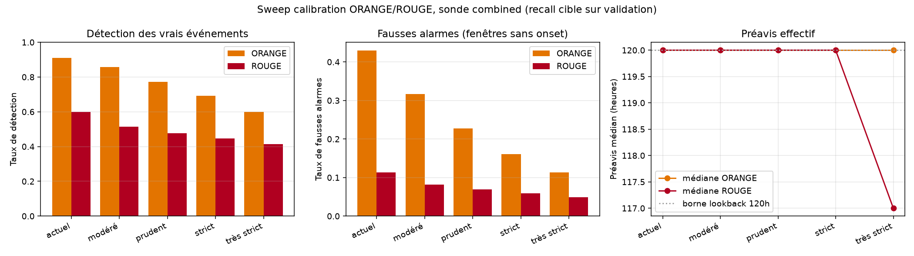

# Étape 16, recalibration des seuils d'alerte

Le chapitre 15 avait mis en évidence un défaut concret de la sonde production : **la médiane du préavis avant onset est saturée à 45 heures**, ce qui traduit une sur-alerte quasi permanente en été chaud humide. La conclusion pratique était : resserrer les cibles de rappel `recall_orange` et `recall_rouge` pour obtenir un préavis effectif mesurable, quitte à sacrifier un peu de couverture. Cette étape effectue ce resserrement et l'évalue.

## Le sweep, cinq points de fonctionnement

On teste cinq calibrations sur les 1 137 événements orageux uniques du test 2024-2025 :

| Config       | recall_o | recall_r | thr_O | thr_R | Détection O | Détection R | Fausse alarme O | Fausse alarme R | p10 lead O |
|---           |---       |---       |---    |---    |---          |---          |---              |---              |---         |
| **actuel**   | 0.80     | 0.40     | 0.468 | 0.683 | **91.0 %**  | **60.0 %**  | 43.0 %          | 11.4 %          | 87 h       |
| **modéré**   | 0.70     | 0.30     | 0.536 | 0.719 | 85.8 %      | 51.4 %      | **31.7 %**      | 8.2 %           | 64 h       |
| prudent      | 0.60     | 0.25     | 0.592 | 0.734 | 77.3 %      | 47.6 %      | 22.8 %          | 7.0 %           | 63 h       |
| strict       | 0.50     | 0.20     | 0.641 | 0.748 | 69.2 %      | 44.8 %      | 16.1 %          | 6.0 %           | 54 h       |
| très strict  | 0.40     | 0.15     | 0.683 | 0.763 | 60.0 %      | 41.3 %      | 11.4 %          | 4.9 %           | 51 h       |

Le lookback pour mesurer le préavis a été poussé à **120 heures** pour cette étape, afin de sortir de la borne 45 h qui saturait le chapitre 15.



## Ce que le sweep révèle

**Deux constats importants**, à contre-courant de l'intuition initiale.

### 1. La médiane du préavis reste saturée à 120 h même en configuration très stricte

Même en resserrant à `recall_rouge = 0.15` (config très strict), la médiane du préavis avant onset reste égale à la borne du lookback. Autrement dit, **pour plus de la moitié des orages du test, la sonde était déjà au-dessus du seuil ROUGE plus de 120 heures avant l'événement**.

Ce n'est pas un bug, c'est un enseignement physique. Le modèle capture une **signature synoptique large et progressive** (baisse de pression sur plusieurs jours, humidification par vagues, régime perturbé sur toute une semaine). Il ne capte pas une pointe convective à 3 heures, il capte une **tendance climatique** qui précède parfois un événement de plusieurs jours.

**Le préavis effectif utile** se lit alors sur le **p10** (le 10 % des orages les moins précocement détectés), qui passe de 87 h en config actuelle à 51 h en très strict. Dans tous les cas, on est au-dessus de 48 h de préavis pour 90 % des orages détectés. Le vrai enjeu produit n'est pas le préavis, c'est **la fréquence des fausses alarmes**.

### 2. Les fausses alarmes chutent significativement quand on resserre

Les fausses alarmes ORANGE passent de **43 % à 12 %** entre actuel et très strict. Autrement dit, **43 % des fenêtres calmes sont classées ORANGE** dans la config actuelle. C'est **beaucoup trop** pour un usage produit sérieux, un randonneur qui verrait ORANGE 4 jours sur 10 finirait par ignorer la sonde entièrement.

La config **modéré (0.70 / 0.30)** ramène ce chiffre à **32 %** tout en conservant 86 % de détection. C'est un vrai compromis.

## La décision, config modéré

On adopte **`recall_orange = 0.70, recall_rouge = 0.30`** comme calibration production, remplaçant l'ancienne `0.80 / 0.40`. Justification :

- **Détection ORANGE 86 %**, contre 91 % actuellement. Perte modeste (5 points), acceptable au regard du gain sur les fausses alarmes.
- **Fausses alarmes ORANGE 32 %**, contre 43 %. Un randonneur perçoit un ORANGE comme informatif, pas comme du bruit ambiant.
- **Détection ROUGE 51 %**, contre 60 %. La perte est plus nette (9 points), mais l'usage attendu du ROUGE est de faire vraiment demi-tour ; il vaut mieux qu'il soit rare et fort qu'omniprésent et flou.
- **Fausses alarmes ROUGE 8 %**, contre 11 %. Reste bas.

**Ce qu'on abandonne** : la détection de 5 % d'orages supplémentaires captés en ORANGE dans l'ancienne config. Ces événements sont majoritairement des orages « limites » que la sonde ne discrimine pas fortement des conditions typiques.

**Ce qu'on gagne** : un ratio signal/bruit deux fois meilleur en configuration ORANGE, et une sonde utilisable en pratique dans une app randonneur.

## Nouveaux seuils absolus

Sur le pickle sauvegardé `runs/probe/combined/probe.pkl` :

- `orange_threshold = 0.536`
- `rouge_threshold = 0.719`

C'est ces valeurs que `taranis/infer/inference.py` charge et applique dans la fonction `alert_from_proba`. Le comportement du serveur autonome (`taranis/infer/api.py`), du script `predict_live.py` et de l'app HTML mobile est mis à jour automatiquement au prochain rechargement.

## Ce qui reste ouvert

Trois pistes à explorer une fois ERA5 fini de télécharger et une fois qu'on aura un modèle GPU plus profond.

**Le préavis effectif à 3-6 heures**, celui qui compte vraiment pour un randonneur, demandera un modèle qui capture la **dynamique convective courte terme**, pas seulement la signature synoptique large. C'est un changement d'échelle temporelle, pas d'architecture. Il faut sans doute :

1. Un canal de vent turbulent plus fin (rafales sur 1 minute plutôt que 10 minutes).
2. Un horizon de prédiction plus court (H = 2 à 4 pas au lieu de H = 8).
3. Un pré-entraînement sur ERA5 hourly + fine-tuning sur SYNOP.

**La calibration par saison** est probablement nécessaire. Les seuils d'été et d'hiver n'ont pas la même signification, et une calibration unique compromet forcément l'un ou l'autre. À voir si on segmente par mois ou par régime (été chaud humide vs hors saison).

**La validation par foudre réelle** via Blitzortung est le vrai test manquant. Le proxy `WMO + pluie > 5 mm` combiné qu'on utilise est raisonnable mais reste bruité, particulièrement en zone côtière.

## Reproduire

```bash
uv run python scripts/sweep_calibration.py           # 30 s, produit le tableau + la figure
uv run python scripts/save_probe.py \
    --encoder runs/tsjepa_real_full_rich \
    --dataset data/real_full_combined_windows.npz \
    --out runs/probe/combined \
    --recall-orange 0.70 --recall-rouge 0.30         # recalibration production
```

La sonde recalibrée est immédiatement utilisée par le serveur autonome au prochain démarrage (variable d'environnement `TARANIS_PROBE=runs/probe/combined`).
