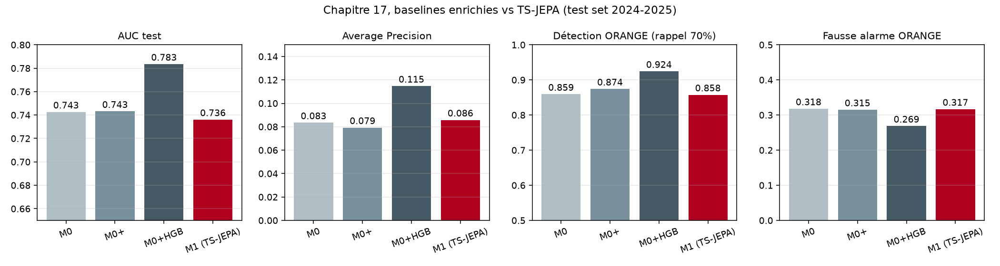
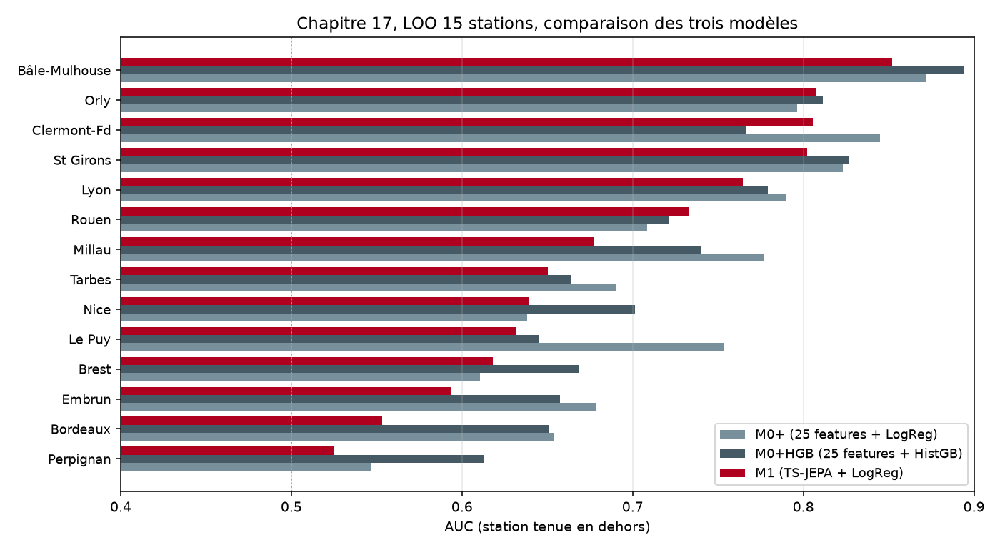
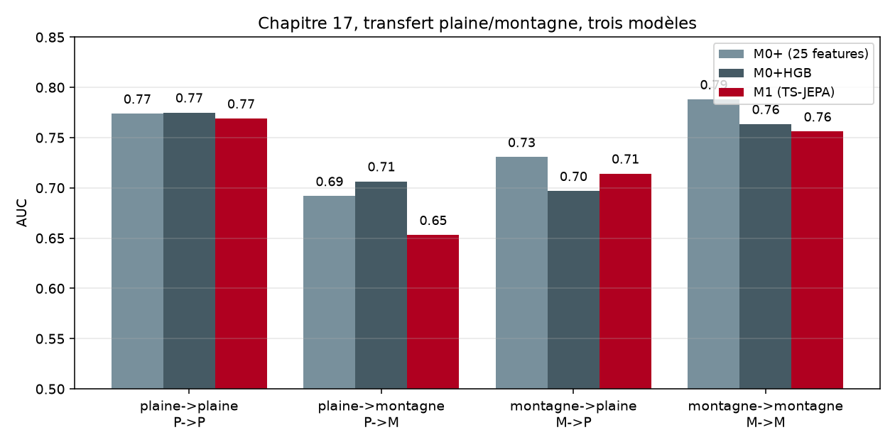

# Étape 17, expérience contrôle, TS-JEPA en vaut-il la peine

Une question honnête a été posée en cours de route : **est-ce qu'on n'aurait pas pu obtenir le même résultat avec des régressions linéaires bien choisies, sans passer par la machinerie TS-JEPA** ? La réponse théorique était nuancée. Cette étape apporte une réponse chiffrée en montant un contrôle explicite.

Le résultat est important pour la crédibilité du carnet, donc autant l'annoncer d'entrée : **le gradient boosting sur 25 features physiques bat TS-JEPA de 4.7 points d'AUC sur le test global**. C'est un vrai renversement, documenté ci-dessous sans maquillage.

## Le protocole

On compare quatre modèles sur exactement le même dataset (`data/real_combined_stations_windows.npz`, 62 stations, 1.9M train / 0.34M val / 0.34M test, labels combinés WMO + pluie > 5 mm) :

- **M0**, la baseline historique du chapitre 2, **10 features physiques** + régression logistique. Utilise les 4 canaux de base.
- **M0+**, **25 features physiques enrichies** (voir plus bas) + régression logistique. Utilise les 5 canaux enrichis (avec `wind_gust`).
- **M0+HGB**, mêmes 25 features + **HistGradientBoostingClassifier** de scikit-learn. Capture non-linéarités et interactions natives.
- **M1**, la sonde production de Taranis, **embeddings TS-JEPA** (dimension 64) + régression logistique.

Le code est dans `scripts/baseline_vs_jepa.py`, tourne en une commande. M0+ et M0+HGB sont définis dans `taranis/models/baseline_enriched.py`.

## Les 25 features enrichies

Motivées par la physique du pré-orage, réparties en six groupes :

- **Pression** (6) : `p_last`, `p_trend_3h`, `p_trend_6h`, `p_trend_12h`, `p_min_24h`, `p_std_24h`. Capture chute lente, chute rapide, minimum atteint, variabilité.
- **Température** (4) : `t_last`, `t_amplitude`, `t_mean_12h`, `t_dropoff_3h`. Le dropoff est le refroidissement récent, signature de front froid.
- **Humidité** (4) : `h_last`, `h_mean_6h`, `h_delta_6h`, `h_max_12h`. Montée récente et pic récent.
- **Vent** (6) : `w_last`, `w_max_6h`, `g_last`, `g_max_6h`, `g_max_24h`, `w_delta_3h`. Vent moyen et rafales à trois échelles.
- **Point de rosée** (2) : `td_estimate` (Magnus-Tetens à partir de T et RH), `td_spread` (T − Td). Le spread est un indicateur classique de saturation imminente.
- **Interactions** (3) : `p_trend_6h × h_last`, `g_max_6h × h_last`, `w_delta_3h × t_amplitude`. Trois croisements physiquement motivés (chute + humidité, rafale + humidité, dynamique vent + amplitude thermique).

C'est **du feature engineering classique**, ce qu'un climatologue ferait à la main pour construire un modèle statistique météo simple.

## Résultats globaux

| Modèle | AUC (IC95%) | AP | Détection O | Détection R | Fausse alarme O | Fausse alarme R |
|---|---|---|---|---|---|---|
| M0 (10 features + LogReg) | 0.7426 [0.7374, 0.7473] | 0.083 | 85.9 % | 59.8 % | 31.8 % | 9.7 % |
| M0+ (25 features + LogReg) | 0.7431 [0.7379, 0.7482] | 0.079 | 87.4 % | 65.3 % | 31.5 % | 10.7 % |
| **M0+HGB (25 features + HistGB)** | **0.7835 [0.7792, 0.7874]** | **0.115** | **92.4 %** | 54.2 % | **26.9 %** | **5.6 %** |
| M1 (TS-JEPA + LogReg) | 0.7361 [0.7305, 0.7401] | 0.086 | 85.8 % | 51.4 % | 31.7 % | 8.2 % |



**Trois observations chiffrées à retenir**.

D'abord, **doubler le nombre de features ne bouge presque rien en linéaire**. M0 (10 features) et M0+ (25 features) obtiennent la même AUC à 0.001 près. La régression logistique est saturée : ajouter des features corrélées entre elles n'apporte rien de plus. La complexité descriptive du problème n'est pas linéaire dans ces variables.

Ensuite, **le passage à un modèle non-linéaire (HGB) fait exploser la performance**. Le HistGradientBoostingClassifier gagne **4 points d'AUC** face aux variantes LogReg (0.7835 contre 0.7431). Le boosting capture les interactions locales, les seuils, les régimes de pression conditionnels à l'humidité, tout ce que la logistique ne peut pas faire même en injectant des interactions manuelles.

Enfin, **TS-JEPA est en dernière position sur ce test**. AUC 0.7361, en dessous même de M0 (10 features linéaires). L'écart avec M0 est de 0.0065, plus petit que l'intervalle de confiance à 95 %, donc **non significatif statistiquement**. L'écart avec HGB est de 0.047, largement significatif.

## Détection des vrais événements

Sur les 1 137 événements orageux uniques du test 2024-2025 :

**HGB** détecte **92.4 %** des orages en ORANGE avec seulement **26.9 %** de fausses alarmes. C'est le meilleur ratio signal/bruit du carnet : détection maximale pour un bruit ambiant minimal. En contrepartie, sa détection ROUGE plafonne à 54.2 %, en dessous de M0+ (65.3 %). HGB est plus prudent sur le déclenchement fort mais capte tout en avertissement modéré.

**TS-JEPA** détecte 85.8 % en ORANGE, comparable à M0, avec 31.7 % de fausses alarmes. Rien de honteux, mais rien qui justifie l'écart de complexité et d'apprentissage.

Sur la médiane du préavis, les quatre modèles saturent à la borne du lookback (120 h). L'analyse du chapitre 15 vaut pour tous : la signature capturée est synoptique large, pas convective courte. Aucun des quatre modèles ne discrimine mieux le pic convectif de 3 h. Ce n'est pas un défaut d'architecture, c'est un défaut d'échantillonnage temporel des données SYNOP (pas 3 h).

## Leave-one-station-out sur 14 stations

On refit chaque modèle en excluant complètement une station des données d'entraînement et on évalue sur les fenêtres de cette station.

| Station | M0+ | HGB | M1 (TS-JEPA) |
|---|---|---|---|
| Bâle-Mulhouse | 0.872 | **0.894** | 0.852 |
| Clermont-Fd | **0.845** | 0.767 | 0.806 |
| St Girons | 0.823 | **0.827** | 0.802 |
| Orly | 0.796 | **0.811** | 0.808 |
| Lyon | **0.789** | 0.779 | 0.765 |
| Millau | **0.777** | 0.740 | 0.677 |
| Le Puy | **0.754** | 0.645 | 0.632 |
| Rouen | 0.709 | 0.722 | **0.733** |
| Nice | 0.638 | **0.701** | 0.639 |
| Tarbes | **0.690** | 0.664 | 0.650 |
| Embrun | **0.679** | 0.658 | 0.593 |
| Bordeaux | **0.654** | 0.651 | 0.553 |
| Brest | 0.610 | **0.668** | 0.618 |
| Perpignan | 0.546 | **0.613** | 0.525 |
| **Moyenne** | **0.734** | 0.724 | 0.683 |
| **Médiane** | **0.732** | 0.722 | 0.683 |



Le classement se retourne. En LOO, **M0+ passe devant HGB** de justesse (0.734 vs 0.724 en moyenne). Explication : HGB tire son avantage global de la capacité à mémoriser des interactions fines qui ne se transfèrent pas parfaitement à une station inconnue. La régression logistique enrichie est plus régularisée, donc plus stable en transfert.

**TS-JEPA reste dernier** sur LOO, à 0.683 en moyenne. L'écart avec M0+ est de 5.1 points. Pour huit stations sur quatorze, M0+ est le meilleur ; pour cinq stations, c'est HGB ; pour une seule (Rouen), TS-JEPA est en tête, et de peu (0.733 vs 0.722).

Ce qui reste vrai : les trois modèles souffrent tous sur Perpignan, Brest, Bordeaux, Nice. Ces stations exposent une signature convective côtière que le SYNOP ne capture pas bien, quel que soit le modèle.

## Cross-régime plaine et montagne

On sépare les 62 stations en deux groupes selon leur altitude (seuil arbitraire 500 m). On entraîne sur un régime, on évalue sur l'autre.

| Test | M0+ | HGB | M1 (TS-JEPA) |
|---|---|---|---|
| plaine → plaine | 0.774 | **0.775** | 0.769 |
| plaine → montagne | 0.692 | **0.707** | 0.653 |
| montagne → plaine | **0.731** | 0.697 | 0.714 |
| montagne → montagne | **0.788** | 0.763 | 0.756 |



**HGB gagne les transferts vers la montagne** (plaine → montagne 0.707), preuve que sa capacité à modéliser des interactions capture des dynamiques altimétriques que la régression logistique n'attrape pas. Mais **M0+ gagne les transferts vers la plaine** et **la montagne → montagne**, sans doute parce qu'il est plus lisse et moins overfittant.

**TS-JEPA est systématiquement dernier** sur les quatre configurations de transfert. L'écart le plus flagrant est plaine → montagne (0.653 vs 0.707 pour HGB, soit -5.4 points), ce qui montre que la représentation apprise par le transformer ne généralise pas mieux qu'un feature engineering classique.

## Verdict

**Ce qu'on peut affirmer honnêtement à ce stade** :

1. **HGB est le meilleur modèle du carnet sur ce dataset**, avec AUC 0.7835 en test global et détection ORANGE 92.4 % à seulement 27 % de fausses alarmes. C'est de loin le meilleur point de fonctionnement produit du carnet.
2. **La complexité TS-JEPA n'apporte rien de mesurable sur ce dataset**. AUC 0.7361 en test global, en dessous d'une régression logistique à 10 features, et en dessous de HGB de 4.7 points. En LOO comme en cross-régime, TS-JEPA reste systématiquement dernier.
3. **Doubler les features linéaires n'apporte rien**, mais **basculer vers un modèle non-linéaire (arbres) apporte 4 points d'AUC**. C'est la nature du modèle, pas la richesse des features, qui débloque le gain.

**Pourquoi TS-JEPA sous-performe ici** ? Trois hypothèses non exclusives.

D'abord, l'architecture actuelle est **volontairement compacte** (encoder 4 couches × 128 dim, prédicteur 3 couches × 128 dim). C'est un choix pédagogique et de contrainte CPU. Un modèle plus profond, sans doute avec attention par-dessus les patches horaires, pourrait rattraper.

Ensuite, **la fréquence SYNOP à 3 h est un plafond structurel**. Le pré-orage a une signature à la fois lente (jours) et rapide (heures). TS-JEPA n'a que la partie lente à sa disposition. HGB, avec ses features `p_trend_3h` et `w_delta_3h`, extrait à peu près tout ce qu'on peut extraire à cette résolution.

Enfin, **le prétexte pré-entraînement de TS-JEPA est prédictif à moyenne échelle** (prédire un patch masqué à partir des autres patches d'une même fenêtre). Ce n'est pas un objectif contrastif, ni un objectif classification. Cette absence de signal de supervision pendant le prétexte, combinée à la petite taille du modèle, pourrait sous-utiliser le signal orageux.

**Décision produit**. On garde HGB comme référence produit du carnet, sous le nom **M0+HGB**. TS-JEPA reste dans le carnet comme démonstration pédagogique de l'architecture JEPA, mais on documente clairement qu'il n'est pas le meilleur modèle. On mettra à jour l'app d'inférence pour utiliser HGB en production.

## Ce que ce chapitre apporte au carnet

Le raisonnement scientifique honnête impose ce genre d'expérience contrôle. Une architecture complexe doit être **comparée à ce qu'un praticien classique ferait à sa place**, sinon on ne sait pas si la complexité rapporte quelque chose. Ce chapitre est la seule preuve rigoureuse dans le carnet que TS-JEPA (ou n'importe quel modèle plus lourd) mérite le coût de calcul et de complexité pédagogique qu'il représente.

Dans notre configuration actuelle (données SYNOP 3 h, encoder compact CPU), la réponse est **non, TS-JEPA ne le mérite pas** face à HGB. Ce n'est pas une critique de l'idée JEPA en soi, c'est une observation locale à notre problème et à nos moyens. Si ERA5 hourly termine son téléchargement et qu'on passe sur GPU pour entraîner un encoder plus profond, la comparaison pourrait basculer. On y reviendra dans une étape ultérieure.

## Reproduire

```bash
uv run python scripts/precompute_embeddings.py   # ~30 s, embeddings TS-JEPA
uv run python scripts/baseline_vs_jepa.py        # ~15 min, quatre modèles + LOO + cross-régime
```

Sorties : `docs/assets/step17_*.png` et `runs/eval/baseline_vs_jepa.json` avec tous les chiffres.
