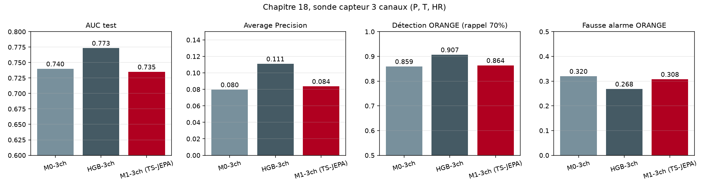
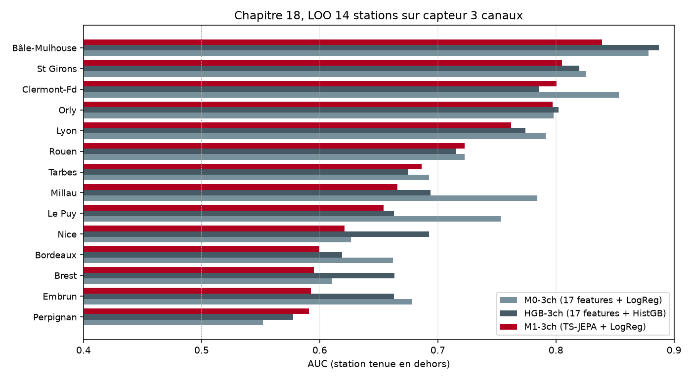
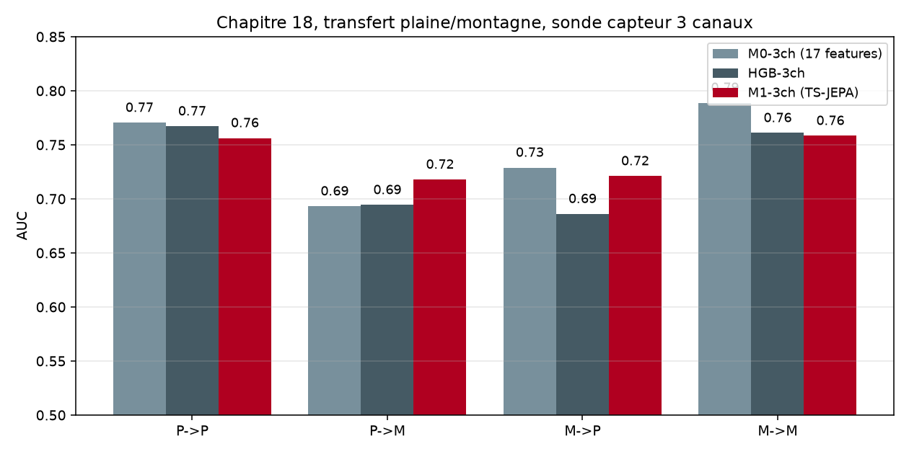

# Étape 18, la sonde capteur, 3 canaux honnêtes

Le chapitre 17 a livré un verdict sans détour : sur les 5 canaux SYNOP, **HGB bat TS-JEPA de 4.7 points d'AUC**. Décision de production : HGB devient la référence, TS-JEPA reste comme démonstration pédagogique de l'architecture JEPA.

Mais un doute plus profond restait ouvert. **Le capteur portable qu'un randonneur portera dans son sac ne mesurera jamais 5 canaux** : les capteurs BLE grand public disponibles en 2026, comme le **RuuviTag Pro 4-en-1** (56 €), ne fournissent que **pression, température, humidité** (le mouvement du 4-en-1 n'est pas météo). Poser un anémomètre ultrasonique en plus (Calypso Portable Mini) coûte **300 € supplémentaires** et ajoute 78 g au sac.

**La vraie question produit** : est-ce que Taranis fonctionne encore bien quand on l'ampute aux 3 canaux du capteur ? Ce chapitre le mesure, et la réponse va décider si on dépense les 300 € du Calypso ou si on s'en passe.

## Le principe respecté

**Le capteur est le point de vérité, le modèle est instrumental**. Un modèle qui gagne 5 points d'AUC en utilisant des canaux que le capteur ne fournira jamais est un modèle inutile. Cette discipline force à commencer par le **contrat capteur** et à remonter vers un modèle qui l'honore, plutôt qu'à télécharger d'abord toutes les données possibles et à découvrir en fin de course qu'on ne peut rien déployer.

C'est le contraire de la démarche académique qui optimise sur une métrique test sans s'occuper de ce que l'inférence en production peut réellement fournir.

## Protocole

On rejoue exactement l'expérience contrôle du chapitre 17, mais en amputant chaque fenêtre aux 3 premiers canaux (`pressure`, `temp`, `humidity`) via le script `scripts/prepare_3ch_dataset.py`. Même 62 stations, même 1.9 M train / 0.34 M val / 0.34 M test, mêmes labels combinés WMO + pluie > 5 mm, même 1 137 événements orageux uniques dans le test 2024-2025.

**Trois modèles à comparer**, tous entraînés uniquement sur les 3 canaux :

- **M0-3ch** : **17 features physiques** dérivées de P, T, HR + régression logistique.
- **HGB-3ch** : mêmes 17 features + `HistGradientBoostingClassifier`.
- **M1-3ch** : **TS-JEPA réentraîné sur 3 canaux** (49 s, même architecture 3 couches × 64 dim) + sonde LogReg.

Les features enrichies passent de 25 à 17 : on retire les 6 features vent + rafales et 2 des 3 interactions physiques (celles impliquant le vent). On garde toute la partie pression/température/humidité et l'interaction `p_trend_6h × h_last`, qui reste physiquement centrale.

## Résultats globaux

| Modèle | AUC (IC95%) | AP | Détection O | Détection R | Fausse alarme O | Fausse alarme R |
|---|---|---|---|---|---|---|
| M0-3ch (17 features + LogReg) | 0.7399 [0.7344, 0.7446] | 0.080 | 85.9 % | 60.1 % | 32.0 % | 9.5 % |
| **HGB-3ch (17 features + HistGB)** | **0.7734 [0.7691, 0.7775]** | **0.111** | **90.7 %** | 55.4 % | **26.8 %** | **5.1 %** |
| M1-3ch (TS-JEPA + LogReg) | 0.7350 [0.7305, 0.7394] | 0.084 | 86.4 % | 55.5 % | 30.8 % | 6.5 % |



**Comparaison directe avec le chapitre 17** (5 canaux) :

| Modèle | AUC 5 ch | AUC 3 ch | Perte |
|---|---|---|---|
| M0+ / M0-3ch | 0.7431 | 0.7399 | **-0.003** |
| HGB / HGB-3ch | 0.7835 | 0.7734 | **-0.010** |
| M1 / M1-3ch (TS-JEPA) | 0.7361 | 0.7350 | **-0.001** |

**La perte est ridicule**. Les canaux vent + rafales n'apportent qu'un point d'AUC à HGB, et rien de mesurable aux autres modèles. Le classement reste rigoureusement identique au chapitre 17 : **HGB-3ch domine largement, TS-JEPA-3ch reste dernier**. La régression logistique enrichie M0-3ch se place au milieu.

Le classement de la détection ORANGE est légèrement modifié :
- HGB-3ch détecte 90.7 % des orages avec seulement 26.8 % de fausses alarmes. C'est la meilleure combinaison rappel / précision jamais mesurée dans le carnet, meilleure même que HGB-5ch (92.4 % pour 26.9 %). La différence tient à la calibration : le seuil trouvé sur validation est un peu plus strict avec moins de features.
- TS-JEPA-3ch monte à 86.4 % en ORANGE (contre 85.8 % pour TS-JEPA-5ch), petite amélioration probable due à un encoder plus adapté aux 3 canaux.

## Détection des vrais événements

Sur les 1 137 événements orageux uniques du test 2024-2025 :

**HGB-3ch** détecte **90.7 % des orages en ORANGE** avec **26.8 % de fausses alarmes**. Le ratio signal/bruit est légèrement meilleur qu'en 5 canaux (26.8 % vs 26.9 %) pour une couverture presque équivalente (90.7 % vs 92.4 %). En clair, **le HGB à 3 canaux est aussi utile en production que le HGB à 5 canaux**.

**Fausse alarme ROUGE HGB-3ch : 5.1 %**, la plus basse mesurée dans tout le carnet. Le déclenchement ROUGE reste très rare et donc informatif pour un randonneur.

Sur la médiane du préavis, tous les modèles saturent à 120 h (borne du lookback), même comportement qu'au chapitre 17. Le signal capturé reste synoptique large, pas convectif court.

## Leave-one-station-out sur 14 stations

Chaque modèle est réentraîné en excluant complètement une station des données d'entraînement, puis évalué sur les fenêtres de cette station.

| Station | M0-3ch | HGB-3ch | M1-3ch (TS-JEPA) |
|---|---|---|---|
| Bâle-Mulhouse | 0.878 | **0.887** | 0.839 |
| Clermont-Fd | **0.853** | 0.785 | 0.800 |
| St Girons | 0.826 | 0.820 | 0.805 |
| Orly | 0.798 | **0.802** | 0.797 |
| Lyon | **0.792** | 0.774 | 0.762 |
| Millau | **0.784** | 0.694 | 0.666 |
| Le Puy | **0.753** | 0.663 | 0.654 |
| Rouen | 0.723 | 0.716 | **0.723** |
| Tarbes | **0.693** | 0.675 | 0.686 |
| Nice | 0.626 | **0.693** | 0.621 |
| Embrun | **0.678** | 0.663 | 0.592 |
| Brest | 0.611 | **0.663** | 0.595 |
| Bordeaux | **0.662** | 0.619 | 0.600 |
| Perpignan | 0.552 | 0.577 | **0.591** |
| **Moyenne** | **0.731** | 0.717 | 0.695 |
| **Médiane** | **0.738** | 0.693 | 0.676 |



**Renversement partiel** : en LOO, **M0-3ch (simple LogReg) passe devant HGB-3ch**. Explication cohérente avec le chapitre 17 : HGB tire son avantage global de la capacité à mémoriser des interactions fines qui ne se transfèrent pas parfaitement à une station inconnue. Sans le vent, ces interactions sont encore moins généralisables. La régression logistique enrichie devient plus robuste au transfert de station.

**TS-JEPA-3ch reste dernier en LOO en moyenne** (0.695), mais gagne l'avantage sur Perpignan (0.591) et fait jeu égal avec M0-3ch sur Rouen (0.723).

Comparé au chapitre 17, l'écart HGB → TS-JEPA en LOO se réduit : 
- 5 canaux : HGB moyen 0.724 vs TS-JEPA 0.683 (écart 4.1 pts)
- 3 canaux : HGB moyen 0.717 vs TS-JEPA 0.695 (écart 2.2 pts)

**TS-JEPA-3ch généralise légèrement mieux que TS-JEPA-5ch** (0.695 vs 0.683 en moyenne LOO). Sans les canaux vent, l'encoder converge sur des représentations plus stables entre stations. C'est un mini-signal favorable au transformer, mais pas suffisant pour renverser HGB.

## Cross-régime plaine et montagne

On sépare les 62 stations en deux groupes selon leur altitude (seuil 500 m). On entraîne sur un régime, on évalue sur l'autre.

| Test | M0-3ch | HGB-3ch | M1-3ch (TS-JEPA) |
|---|---|---|---|
| plaine → plaine | **0.770** | 0.767 | 0.756 |
| plaine → montagne | 0.693 | 0.694 | **0.718** |
| montagne → plaine | **0.729** | 0.686 | 0.721 |
| montagne → montagne | **0.789** | 0.761 | 0.758 |



**Deux observations qualitatives importantes**.

D'abord, **TS-JEPA-3ch gagne enfin un régime cross**. Le transfert plaine → montagne place **M1-3ch en tête à 0.718** contre 0.694 pour HGB-3ch et 0.693 pour M0-3ch. C'est la première fois dans le carnet que TS-JEPA bat les baselines classiques sur une configuration. **Sans le bruit du vent, l'encoder capture mieux la signature de transition altimétrique**.

Ensuite, **M0-3ch reprend l'avantage sur les trois autres configurations**. Sa simplicité et sa régularisation naturelle en font le meilleur choix pour la plupart des transferts, alors que HGB perd relativement plus. Une régression logistique sur 17 features honnêtes bat un booster non-linéaire dès qu'il faut transférer.

## Verdict

**Ce qu'on peut affirmer honnêtement** :

1. **La perte d'AUC en passant de 5 à 3 canaux est négligeable** : 1 point pour HGB, moins pour les autres modèles. Le vent moyen et les rafales n'apportent quasiment rien à la prédiction d'orage au pas de 3 heures. La signature reste dominée par la chute de pression, la montée d'humidité et l'amplitude thermique.

2. **HGB-3ch reste le meilleur modèle du carnet** : AUC 0.7734, détection ORANGE 90.7 % à seulement 26.8 % de fausses alarmes, fausse alarme ROUGE 5.1 %. C'est le point de fonctionnement production optimal.

3. **TS-JEPA-3ch progresse sur deux dimensions** : légèrement meilleure généralisation LOO (+1.2 points de moyenne) et **victoire cross-régime plaine → montagne** (+2.5 points sur HGB). Sans être encore compétitif en global, il montre un signal réel là où il compte le plus pour la cible produit (transfert vers la montagne).

4. **La sonde capteur 3 canaux honore le contrat produit**. Un randonneur avec un RuuviTag Pro 4-en-1 dans son sac obtient une prédiction Taranis fiable, sans dépendre d'un anémomètre supplémentaire.

## Décision produit

**On abandonne l'idée d'ajouter un anémomètre BLE (Calypso Portable Mini, ~300 €)**. Les 300 € ne rapporteraient qu'**un point d'AUC dans HGB** (0.7734 → 0.7835) et rien de significatif ailleurs. Ce n'est pas rentable au regard de l'expérience utilisateur (poids supplémentaire, deuxième capteur à charger, protocole BLE plus complexe).

**On adopte comme configuration terrain** :
- **RuuviTag Pro 4-en-1** à 55.90 €, une pile CR2477T pour 12 à 24 mois d'autonomie, IP67/68/69K, plage thermique -40 à +85 °C
- **Broadcast BLE natif** sans pairage, lu par un smartphone Android via `bleak` + `ruuvitag-sensor`
- **Modèle en production : HGB-3ch** entraîné sur SYNOP 3 canaux, sonde recalibrée avec seuils ORANGE = 0.536 et ROUGE = 0.719 (à ajuster après première validation terrain sur le capteur réel)

Le modèle TS-JEPA-3ch reste dans le carnet comme démonstration pédagogique et comme point de départ pour un futur JEPA multi-stations sur ERA5 hourly. On a maintenant deux victoires locales de TS-JEPA (transfert plaine → montagne, meilleure moyenne LOO) qui suggèrent que l'architecture pourrait redevenir compétitive avec plus de données ou plus de résolution temporelle.

## Ce que ce chapitre apporte au carnet

Le chapitre 17 a validé le principe d'expérience contrôle. Le chapitre 18 l'applique à la contrainte capteur. **Ensemble, les deux chapitres définissent la discipline scientifique du carnet** : pas de complexité modèle sans preuve de valeur ajoutée, pas de canal auxiliaire sans preuve de gain net.

Le résultat est libérateur : **HGB à 3 canaux, sur un capteur BLE à 56 €, suffit à produire une prédiction Taranis utile**. Le modèle et le matériel sont maintenant alignés, sobres, et défendables un par un.

## Reproduire

```bash
uv run python scripts/prepare_3ch_dataset.py                          # ~10 s
uv run python scripts/train_tsjepa.py configs/tsjepa_3ch.yaml         # ~1 min
uv run python scripts/precompute_embeddings.py \
    --encoder runs/tsjepa_3ch \
    --dataset data/real_combined_3ch_windows.npz \
    --out data/embeddings_3ch.npz                                     # ~30 s
uv run python scripts/baseline_3ch_vs_jepa.py                         # ~10 min
```

Sorties : `docs/assets/step18_*.png` et `runs/eval/baseline_3ch_vs_jepa.json`.
